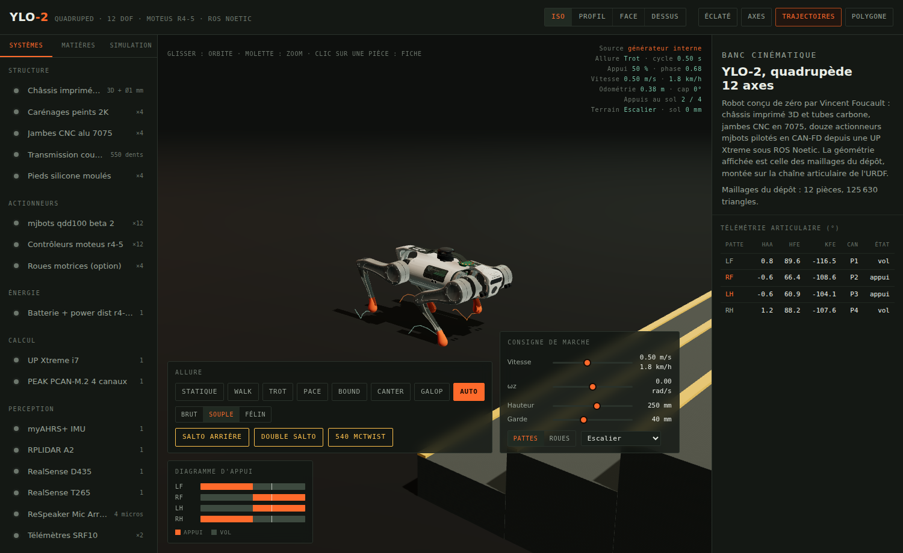
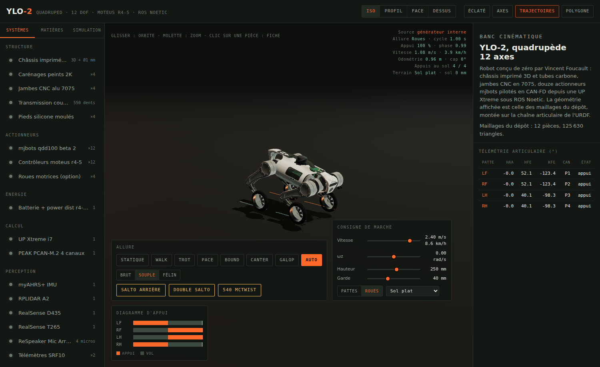
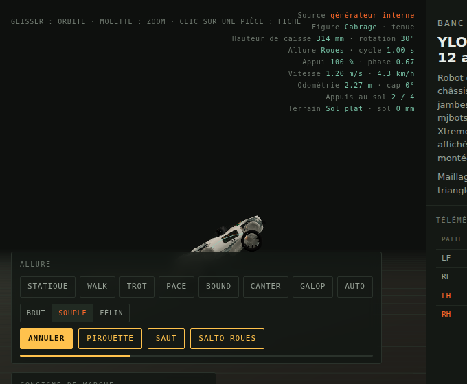
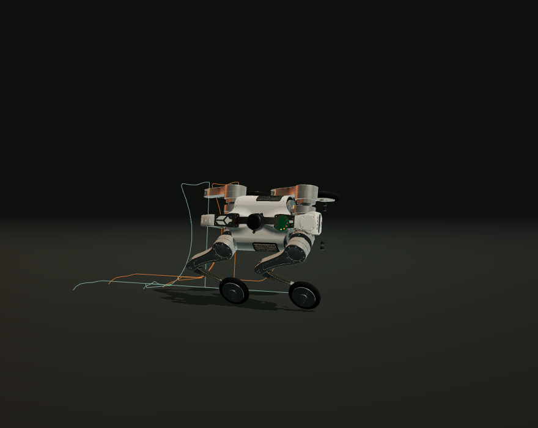
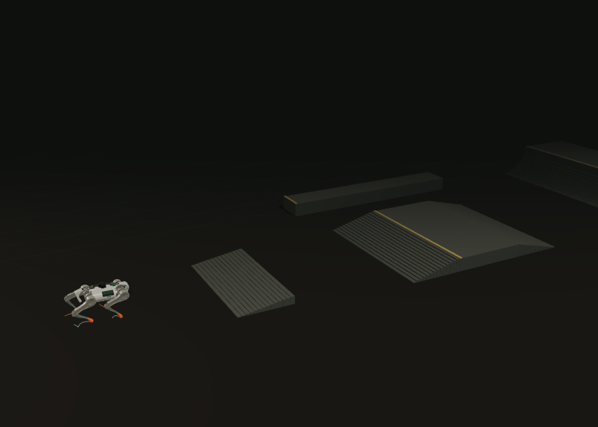

# YLO-2 — Banc cinématique 3D

Visualiseur 3D interactif et simulateur du quadrupède **YLO-2** de Vincent Foucault
([elpimous/ylo-2](https://github.com/elpimous/ylo-2)) : la machine est affichée avec
ses **vrais maillages**, montée sur la chaîne articulaire de son URDF, animée soit
par un générateur d'allure dans le navigateur, soit par des **scripts Python**.










## Trois pièces

| | Où | Quoi |
| --- | --- | --- |
| **Visualiseur** | `index.html` | page autonome : géométrie réelle, allures, télémétrie, éditeur de matières |
| **Convertisseur** | `tools/convert_meshes.py` | transforme les `.dae`/`.stl` du dépôt en paquet binaire compact |
| **Simulateur** | `sim/` | paquet Python `ylo2-sim` : cinématique, allures, bus CAN, trajectoires |

## Ouvrir

```sh
./build.sh        # assemble index.html (à refaire après toute modification de src/)
```

Puis ouvrir `index.html` dans un navigateur. Aucun serveur, aucune dépendance
réseau : three.js et les maillages sont embarqués dans le fichier (le seul appel
externe est Google Fonts, et la page reste lisible sans).

## Géométrie réelle

Les visuels affichés sont ceux du dépôt d'origine, pas des primitives :

| Pièce | Fichier source | Triangles |
| --- | --- | --- |
| Tronc | `ylo2_textured_body.dae` | 18 470 |
| Carénages | `ylo2_textured_cover.dae` | 30 064 |
| Moteurs ABAD | `ylo2_textured_abad_motors.dae` | 3 360 |
| Hanche | `ylo2texturedhip.dae` | 5 534 |
| Cuisse | `ylo2_textured_upper_leg.dae` | 30 000 (décimée depuis 49 176) |
| Jambe | `lower_leg.dae` | 7 284 |
| Pied | `fl_foot.dae` | 9 020 |
| Batterie, D435, T265, accessoires, lidar | `.dae` / `.stl` | 3 × … |

`tools/convert_meshes.py` les charge, nettoie (faces dupliquées ou dégénérées,
sens des normales), calcule les normales coin par coin avec un angle de cassure
de 35°, et écrit `assets/ylo2-geometry.bin` (4,0 Mo) + son index. `build.sh`
embarque le tout gzippé en base64 : la page fait 3,2 Mo et s'ouvre en `file://`.

Trois défauts d'affichage ont été corrigés à la source plutôt que masqués :

| Symptôme | Cause | Correctif |
| --- | --- | --- |
| Éclats triangulaires sur la cuisse | la décimation repliait la coque sur elle-même | plus de décimation par défaut (`--max-tris` pour forcer) |
| Coins mal éclairés sur les tambours | `smooth_shaded` regroupe par facettes coplanaires | normales par coin, moyenne pondérée sous l'angle de cassure |
| Scintillement hanche / carter d'abduction | surfaces coïncidentes entre deux pièces de l'URDF | `polygonOffset` sur le groupe hanche |

L'acné d'ombre sur les surfaces cylindriques est traitée par un `normalBias`
adapté, pas en désactivant les ombres.

```sh
python3 tools/convert_meshes.py --repo /chemin/vers/ylo-2   # régénère les maillages
```

Les placements (rotations et miroirs des visuels de hanche, `scale="1 -1 1"` des
cuisses droites, décalage du pied) reprennent exactement les `<xacro:if>` de
`leg.xacro`. Les pièces absentes du dépôt — UP Xtreme, PCAN-M.2, myAHRS+,
ReSpeaker, SRF10 — restent des volumes simples, signalés comme tels dans les fiches.

## Couleurs et motifs

Onglet **Matières** : dix groupes de pièces (carénages, châssis, moteurs ABAD,
hanches, cuisses, jambes, pieds, capteurs, batterie, électronique). Pour chacun,
couleur, métallicité, rugosité, motif et échelle du motif.

Les motifs sont dessinés sur canvas, donc modifiables dans
`src/20-materials.js` : alu brossé, carbone, impression 3D, anodisé, nid
d'abeille, tôle perforée, bandes d'atelier. Cinq ambiances servent de point de
départ (Atelier, Carbone, Chantier, Labo, Nuit).

Les maillages du dépôt n'ont pas de coordonnées de texture exploitables : les
motifs sont donc projetés en **triplanaire** dans le repère local de chaque
pièce (`onBeforeCompile`, trois échantillons pondérés par la normale). Pas de
couture, pas d'UV à produire, et le motif reste collé à la pièce quand elle
bouge. L'échelle du curseur est en motifs par mètre.

Les réglages sont conservés dans le navigateur (`localStorage`) et s'exportent en
JSON (`ylo2.materials/1`) pour être repris ailleurs.

## Courir : l'allure suit la vitesse

Le curseur de vitesse va de −0,6 à 2,0 m/s sur pattes (3,0 m/s en roues) et
l'allure se choisit toute seule, comme chez l'animal : la durée d'appui décroît
en v^−0,55, le rapport d'appui baisse avec la vitesse, et des instants sans
aucun appui apparaissent — la suspension du galop.

| Consigne | Allure | Cycle | Suspension | Pic articulaire |
| --- | --- | --- | --- | --- |
| 0,15 m/s | Walk | 0,47 s | — | 6,1 rad/s |
| 0,50 m/s | Trot | 0,50 s | 5,8 % | 9,8 rad/s |
| 1,00 m/s | Canter | 0,43 s | 0,6 % | 12,0 rad/s |
| 1,60 m/s | Galop | 0,35 s | 18,6 % | 13,9 rad/s |
| 2,00 m/s | Galop | 0,35 s | 20,1 % | 26,2 rad/s |

Repères du commerce, pour situer : l'[Unitree Go2](https://www.unitree.com/go2)
annonce 3,7 m/s, le [B2](https://www.unitree.com/b2/) 6 m/s. YLO-2 est plus
petit, et surtout ses qdd100 sont donnés à 20 rad/s dans l'URDF : **au-delà de
1,7 m/s, la page prévient que le mouvement montré sort de la spécification**.
Jusque-là, tout ce qui est affiché reste dans l'enveloppe déclarée.

Le corps suit une vraie balistique pendant les phases de suspension (z'' = −g),
et un rappel amorti au contact — c'est ce qui donne le poids à la réception.

## Terrains et obstacles

Un sélecteur, douze terrains, et un bouton **Réinitialiser** (touche `R`) qui
replace le robot au centre, à plat, face au +X — le plus court chemin pour
réattaquer un obstacle. Changer de terrain le déclenche aussi, sinon on peut se
retrouver dans un mur. La même description analytique sert à calculer la hauteur
sous chaque pied et à construire les volumes affichés : le contact et la
géométrie sont la même chose, il n'y a pas de collision approchée.

| Terrain | Relief | Ce qu'il montre |
| --- | --- | --- |
| Sol plat | — | référence |
| Escalier | 8 marches de 130 mm × 300 mm, palier, descente | montée continue |
| Marches hautes | 5 marches de 180 mm | la limite du gabarit |
| Plateforme | marche unique de 240 mm | franchissement franc |
| Rampe 20° | pente continue | assiette qui épouse la pente |
| Gravats | blocs jusqu'à 90 mm | appuis à des hauteurs différentes |
| **Skatepark** | mini-plaza : kicker, funbox, ledge, deux quarter pipes | reliefs enchaînés, en pattes comme en roues |
| **Champ de tir** | gravats, mur **destructible** à fenêtres, carcasse de voiture, passerelle, douze cibles dont trois en hauteur et trois **mobiles** | rouler et tirer en même temps |
| **Big ramp** | mini-ramp : deux transitions de 1,20 m face à face | un objet qu'on **roule** au lieu de le franchir |
| **Mega ramp** | roll-in de 2,60 m, tremplin, gap, réception, transition de 2,60 m | un run complet, de la vitesse jusqu'au saut |
| **Méga-parcours** | tout le catalogue à la suite, **fenêtre comprise** | 46 m d'obstacles enchaînés |
| Poutres | traverses de 140 mm | enjambement |

### Le skatepark



Une mini-plaza dans l'esprit des skateparks en béton de Californie, réduite au
gabarit du robot — un funbox de skate fait 40 cm de haut, celui-ci 180 mm :

| Élément | Cote | Position |
| --- | --- | --- |
| Kicker d'entrée | plan à 100 mm | x 1,40 → 2,10 |
| Funbox | bank, plateau de 180 mm, bank | x 3,60 → 6,00 |
| Ledge de grind | 200 mm, le long du funbox | x 3,40 → 6,20, y 1,70 → 2,10 |
| Quarter pipes | transition de 450 mm + plateforme | x 7,80 et x −2,60, face à face |

Les modules sont largement espacés : **au moins 1,5 m de plat entre deux**, plus
2,6 m derrière la ligne de départ et 750 mm de dégagement entre le funbox et le
ledge. Il faut de l'élan avant chaque obstacle et de quoi se replacer après,
sinon on les enchaîne sans jamais rouler.

Les transitions sont de vrais quarts de cercle : le profil part tangent au sol
et finit vertical, découpé en 24 tranches qui restent au-dessus de la courbe.
Le robot les monte en partie — en roues il atteint la plateforme haute à
450 mm — mais le haut d'un quarter est vertical, donc hors gabarit par
construction.

Mesuré à 0,6 m/s en pattes : **0,1 % des instants dépassent 20 rad/s**, contre
11,7 % sur l'escalier de 130 mm. Le parc est plus roulant que les marches,
parce que ce sont des plans inclinés et non des ressauts.

Quatre mécanismes s'enclenchent tout seuls, comme sur un vrai contrôleur :

- **gouverneur de vitesse** — le relief détecté à 0,75 m devant réduit la
  consigne jusqu'à 25 %, ce qui laisse le temps au vol de se faire ;
- **redressement** — la garde au sol de la caisse augmente de 18 % sur relief ;
- **dégagement adaptatif** — le vol passe au-dessus du plus haut point rencontré
  entre le décollage et le poser, plus la garde nominale ;
- **pas raccourci** — une pose hors d'atteinte est ramenée dans l'enveloppe de
  la patte avant d'être visée, plutôt que saturée à l'exécution.

Sur l'escalier de 130 mm, la médiane des vitesses articulaires reste à
6,7 rad/s ; 5 % des instants dépassent brièvement les 20 rad/s déclarés, au
moment où la patte est fouettée sur la marche suivante. Les marches de 180 mm
sont franchies mais sortent du gabarit : le robot y traîne les pieds.

### La big ramp, et la roue libre

Les rampes des autres terrains se **franchissent** : on arrive dessus, on passe
par-dessus, on redescend. C'est voulu — elles sont là pour montrer qu'une patte
de 445 mm avale un relief. La big ramp est l'inverse : un objet de skate, qu'on
n'y franchit pas mais qu'on **roule**.

| Élément | Cote | Position |
| --- | --- | --- |
| Flat | 6,40 m entre les deux courbes | x −3,20 → 3,20 |
| Transitions | quart de cercle de 1,20 m, 48 tranches de 25 mm | x 3,20 → 4,40 et symétrique |
| Decks | plateformes de 1,30 m derrière le coping | au-delà de 4,40 m |

Deux mécaniques manquaient pour qu'elle serve à quelque chose.

**La gravité le long de la pente.** Jusqu'ici la consigne de vitesse était une
*consigne* : un régulateur la tenait, quelle que soit la pente. Une transition
n'y changeait donc rien — on la remontait à vitesse constante comme un tapis
roulant. En mode PLAY, la commande devient une **poussée** : le moteur pousse
jusqu'à sa consigne et n'y retient jamais, c'est le frein qui retient, et entre
les deux la pente rend ou reprend l'élan (0,85 g le long de la pente, moins un
frottement de roulement de 0,22 s⁻¹). Lâché en haut d'une transition, le robot
redescend seul et atteint 2,5 m/s en bas — exactement `√(2gh)` corrigé du
frottement.

**L'envol.** Quand le sol se dérobe — la lèvre d'une transition, le bord d'un
deck — les roues ne peuvent plus le rattraper. Le robot part alors en
balistique et la suspension amortit la réception au lieu de l'annuler. Mesuré :
sorti du deck à 1,20 m et 2,2 m/s, **0,50 s de vol** (la chute libre de 1,20 m
en fait 0,49), la caisse s'écrase de 8 cm au poser puis remonte, la vitesse est
conservée.

Ces deux mécaniques sont réservées au mode PLAY. La session AUTO et le
simulateur Python doivent rendre la même trace à chaque exécution : une gravité
qui s'ajoute à la consigne les rendrait dépendants de la moindre pente.

### La mega ramp : un run entier

La big ramp est un objet ; la mega ramp est un **parcours**. On part de haut,
on convertit la hauteur en vitesse, on saute un gap, on se reçoit sur une pente
qui rend la chute supportable, et on finit dans une grande transition. Le robot
démarre en haut du roll-in — une transition de 2,60 m ne se remonte pas, un
robot posé en bas n'y aurait aucun accès — et le bouton **Réinitialiser** l'y
remet.

| Élément | Cote | Position |
| --- | --- | --- |
| Plateforme de départ | 2,60 m | x −17,0 → −15,0 |
| Roll-in | pente **droite** à 18°, 80 tranches | x −15,0 → −7,0 |
| Tremplin | 700 mm sur 2,20 m, soit 18° | x 0 → 2,20 |
| Gap | 1,00 m de vide | x 2,20 → 3,20 |
| Réception | pente descendante de 400 mm sur 3,40 m | x 3,20 → 6,60 |
| Transition finale | quart de cercle de 2,60 m + plateforme | x 13,0 → 15,6 |

**Le roll-in est une pente droite, pas un quarter pipe**, et ce n'est pas un
détail de forme. Sur une transition, le haut est vertical : le robot quitte le
coping en chute libre, et à l'impact il ne récupère que la composante de sa
vitesse le long de la surface — la moitié de la hauteur part en chaleur. Sur
une pente droite, les roues ne quittent jamais le sol. Mesuré : **5,88 m/s** en
bas, contre 6,6 m/s en théorie parfaite et 4,8 avec un roll-in en transition.

Un run complet, gaz à 1,2 m/s seulement (le reste, c'est la pente) :

| | |
| --- | --- |
| Bas du roll-in | 5,88 m/s |
| Arrivée au tremplin | 5,10 m/s |
| Décollage | x 2,03 · point haut **1,17 m** |
| Réception | sur la pente, **3,6 m/s conservés** |
| Transition finale | remontée à 1 m, retour en fakie |

Trois mécaniques ont dû être ajoutées pour que ça tienne debout.

**Le tremplin lance vraiment.** Au décollage, la vitesse verticale n'est pas
nulle : elle vaut celle que la pente donnait à la caisse juste avant la lèvre,
v·tan(pente). Sans ce terme, le robot quittait le tremplin à plat et tombait
dans le gap.

**La réception redirige au lieu d'encaisser.** Une transition conserve la
composante de la vitesse le long de la surface — c'est pour ça qu'un drop-in
rend de la vitesse. La pente de réception se lit sur le **sol** et non sur les
hauteurs de roue : au moment de toucher, une roue arrière peut encore survoler
le gap, sa hauteur filtrée vaut zéro, et l'assiette calculée sur les roues
donnait 46° de nez en l'air là où la pente réelle en fait 7. La réception
mangeait alors toute la vitesse du saut — 3,7 m/s à l'entrée, 0,4 à la sortie.

**En vol, les roues pendent.** Elles ne vont pas chercher un sol qui peut être
un mètre plus bas. Sans ça, la patte partait en butée d'allonge pendant tout le
saut et devait tout rattraper en une image au poser : 180 rad/s.

Et un défaut de suspension est apparu au passage : **l'amortisseur travaillait
sur la vitesse absolue de la caisse** et non sur la vitesse relative entre la
roue et elle. C'est un système du second ordre suivant une rampe : il garde une
erreur permanente. En descendant le roll-in, la caisse restait une trentaine de
centimètres au-dessus de sa garde, assez pour que le robot **se croie en l'air
pendant toute la descente** — et n'y gagne donc aucune vitesse. L'anticipation
est filtrée à 6 s⁻¹ : une pente descendue longtemps finit compensée, un saut de
consigne ne devient pas une impulsion.

Le run entier coûte **26 rad/s** au pire, au décollage du tremplin. C'est
au-dessus des 20 rad/s de l'URDF, et la page le dit : à plus de 3 m/s en roue
libre, le bandeau d'avertissement signale que le mouvement est montré et non
certifié. Une grande rampe rend bien plus de vitesse que les moteurs n'en
donnent — c'est tout l'intérêt, et c'est aussi la limite.

### Le méga-parcours, et la fenêtre

Tout le catalogue mis bout à bout, dans l'ordre où on aurait envie de
l'enchaîner : on part de 2,60 m, on prend de la vitesse sur le roll-in, on
traverse des gravats et des poutres, on monte un escalier, on **passe par une
fenêtre**, on franchit une marche de 240 mm, un funbox, des marches hautes, on
saute un gap, et on finit dans une transition. 46 m, 279 volumes, et le robot
démarre en haut.

**La fenêtre est le seul obstacle qui ne soit pas un champ de hauteurs.** Tout
le reste du terrain est une colonne pleine depuis le sol — c'est ce qui rend le
contact exact et bon marché — et une colonne ne sait pas dire « plein en haut,
vide au milieu ». Il a donc fallu un second type de volume : le **linteau**,
qui a un dessous. Il ne compte pas dans `heightAt` : il n'y a rien à poser une
roue dessous. Il n'existe que pour ce qu'il empêche.

| | |
| --- | --- |
| Jambages | pleins, 2,00 m, de part et d'autre d'une ouverture de 900 mm |
| Appui | 240 mm : il se franchit en levant la patte |
| Linteau | dessous à 620 mm : il se franchit en **baissant la caisse** |

C'est le seul obstacle du jeu qui demande de descendre le tronc plutôt que de
lever la jambe. Sur roues, il faut passer la garde à **200 mm** : à 250, mesuré,
le robot s'arrête net devant le montant, parce que l'essieu porte la caisse un
rayon plus haut que sur pattes.

Sur pattes, c'est plus subtil et il vaut mieux le dire : enjamber un seuil de
240 mm **relève la caisse** — le générateur d'allure lève le tronc avec les
pieds — et la marge sous le linteau se joue alors à quelques millimètres. À
300 mm de garde le robot bute franchement ; en dessous il passe, mais de peu.
Pour le faire proprement il faudrait qu'il s'accroupisse *pendant* l'enjambée,
ce que la couche d'allure ne sait pas faire aujourd'hui.

Un défaut de parité a été trouvé en chemin, sans rapport avec la fenêtre : le
générateur pseudo-aléatoire des gravats multipliait deux entiers dont le
produit dépasse 2^53, et un nombre JavaScript y perd des bits. Les deux moteurs
posaient donc des blocs différents pour la même description — 103 d'un côté,
98 de l'autre. `Math.imul` rend le produit exact ; ils en posent maintenant 98
tous les deux, et un test l'épingle.

### Rouler comme au skate : pomper, sauter, tourner, enchaîner

Une grande rampe ne se franchit pas, elle se **roule** — mais rouler ne suffit
pas. Il manquait les trois gestes qui font qu'un skatepark est un terrain de
jeu et non une suite d'obstacles.

**Pomper.** Dans une transition, un skateur ne subit pas la courbe : il se
ramasse en y entrant et se détend au creux. Ce travail, fait contre la force
centrifuge, ajoute de la vitesse à chaque passage. Sans lui, la première
transition venue avalait l'élan et le robot restait à osciller au fond — il
« ne passait plus les obstacles ». Avec lui, un quarter pipe devient un
tremplin qu'on charge en deux ou trois allers-retours. Mesuré : dans le
skatepark, à 1 m/s de consigne, le robot passait de x = 7,9 (arrêté au pied du
quarter) à **x = 15,8** — il le franchit maintenant, et par le haut. La caisse
se ramasse de 16 % pendant le pompage : ça se voit.

**Tourner en l'air, pas depuis le sol.** C'est le vrai changement. Les figures
du catalogue possèdent leur propre envol : elles s'arment, poussent, volent et
se reçoivent, d'un bloc. En l'air, le vol est déjà là — la figure n'ajoute
qu'une **rotation**. Le même bouton fait donc deux choses selon l'endroit d'où
on appuie, et c'est toute la bascule : on quitte la lèvre d'abord, on choisit
ensuite ce qu'on fait pendant qu'on monte.

| En l'air | Rotation | Durée | Points |
| --- | --- | --- | --- |
| Salto arrière / avant | 1 tour de tangage | 0,34 s | 100 |
| Double salto arrière / avant | 2 tours | 0,56 s | 260 |
| Salto latéral gauche / droit | 1 tour de roulis | 0,36 s | 120 |
| Double latéral | 2 tours | 0,58 s | 300 |
| 360 | 1 tour de lacet | 0,32 s | 90 |
| 540 McTwist | 1 tangage + 1,5 lacet | 0,48 s | 400 |

Chaque figure a sa vitesse propre, et **on ne refuse pas celles qui semblent
trop longues** : c'est au joueur de juger sa hauteur. Tenter une figure trop
lente pour le vol qui reste, c'est se recevoir de travers — sous 85 % de la
rotation, c'est une chute et l'enchaînement est perdu. Seul un décollage
manifestement trop bas est refusé, parce que là il n'y a rien à juger.

**Enchaîner.** Une rotation bouclée en l'air libère la place pour la suivante,
tant qu'il reste du vol. À la réception, l'enchaînement est validé et multiplié
par le nombre de figures : deux figures dans le même saut valent quatre fois
une seule. C'est ce qui pousse à en tenter une de plus au lieu de se poser.

```
360 + Salto arrière ×2        380 pts
```

Relevé sur les dix figures aériennes : **14 à 21 rad/s** au pire, aucune butée.
C'est bas parce que, pendant la rotation, les jambes sont figées dans le repère
de la caisse — sinon elles courraient après un sol qui tourne autour d'elles.
Le groupé et l'ouverture ont leur propre durée, indépendante de la vitesse de
rotation : une jambe ne se replie pas deux fois plus vite parce qu'on tourne
deux fois plus vite.

### Départ et arrivée

La caméra est la **même partout** : celle du skatepark, libre, qui ne suit
personne. Une vue de suivi avait été écrite pour les parcours, elle a été
retirée — sur ces terrains-là on veut regarder où l'on veut, et une caméra qui
se replace toute seule reprend la main juste au moment où on la lui prend.

Le méga-parcours a une zone de **départ** (verte, en haut du roll-in) et une
zone d'**arrivée** (orange, avant la transition finale). Ce sont des décors :
elles ne comptent ni dans la hauteur du sol ni dans les collisions. Le
chronomètre part quand le robot **quitte** le départ — pas quand on appuie sur
un bouton, c'est le premier mètre parcouru qui compte — et s'arrête en entrant
dans l'arrivée. Revenir se poser sur le départ remet tout à zéro : on retente
sans rien réinitialiser, et le meilleur temps est gardé.

### La livrée officielle

Les couleurs par défaut ne sont plus choisies à l'œil : elles sont **relevées
dans les textures des maillages officiels**, celles-là mêmes dont ce
visualiseur affiche la géométrie. Les `*color.png` des dossiers `textured` de
`champ_for_ylo2/ylo2_description` donnent, en fréquence de pixels :

| Pièce | Texture | Couleur dominante |
|---|---|---|
| Carénages | `covers.png` | **#fc9000**, orange, 99 % |
| Corps | `bodycolor.png` | #000000 → #0c0c0c, noir mat, 93 % |
| Hanches, cuisses, jambes | `hip/upper/lowercolor.png` | #181818, 94 à 100 % |
| Moteurs mjbots | `abadcolor.png` | **#fcfcfc**, blanc, 55 % |
| Pieds silicone | `footcolor.png` | #909c9c, gris-bleu |

C'est donc un robot **orange sur châssis noir, moteurs blancs** — et non le
gris d'atelier d'avant. Les **jantes prennent l'orange du robot** et le
**moyeu reste noir** : il empruntait jusqu'ici la matière des moteurs, blanche,
et la roue entière rendait claire. Le moyeu a désormais sa propre matière,
éditable comme les autres. Les anciens réglages restent disponibles sous le thème
« Atelier », et le nouveau défaut a son thème « Officiel ».

### Le champ de tir

Un septième terrain, **Champ de tir** : une plateforme de tir de 3,2 m sur 3,6
m, deux merlons de terre à ±4,2 m qui ferment le couloir, et un talus de
réception au fond qui monte à 1,60 m — une ligne de tir a toujours un
pare-balles derrière les cibles.

**Douze silhouettes**, entre 6 et 29 m, décalées à gauche et à droite pour
qu'aucune ne se prenne dans l'axe de la précédente. **Trois sont en hauteur** :
sur le toit de la voiture à 1,32 m, sur un muret à 1,20 m, sur la passerelle à
1,85 m. Une cible haute n'est pas une autre sorte de cible — c'est la même,
posée plus haut : la troisième valeur de sa description est la hauteur de son
pied, et c'est à la tourelle de lever le canon pour aller la chercher.

**Ce qu'il y a entre elles.** Un couloir vide se traverse en ligne droite, et
un stand qui se vide en ligne droite n'est pas un parcours :

- **deux nappes de gravats**, à 4 et à 16 m — on ne roule pas vite dessus, et
  ralentir est justement ce qui permet de tirer juste ;
- **un mur en travers**, percé d'une **porte** au milieu et de **deux
  fenêtres** de part et d'autre. Les fenêtres ne se passent pas : leur allège
  fait 500 mm, cinquante de plus que ce qu'une roue peut monter. Elles se
  **tirent** à travers, et c'est là tout leur intérêt — une cible cadrée dans
  une fenêtre ne se prend que d'un endroit, et il faut le trouver. La porte,
  elle, se franchit : son linteau est à 800 mm, au-dessus de la caisse à
  toutes les hauteurs de conduite. C'est le seul passage du mur ;
- **une carcasse de voiture** en travers de la voie, caisse rouge et vitrage
  sombre, qu'on contourne et dont le toit porte une cible. Elle est décrite
  comme le reste du terrain — des boîtes — mais **porte ses propres
  matières** : la découper en décor à part reviendrait à décrire deux fois la
  même chose, une fois pour l'œil et une fois pour le contact ;
- **une passerelle** et sa rampe d'accès, qui portent la cible haute du fond.

**Les cibles se lèvent toutes seules.** Elles restent couchées tant que le
robot n'est pas sur la plateforme ; entrer dans la zone les redresse et lance
le chrono, et la série est finie quand la dernière tombe. Sortir de la zone
recouche tout et remet à zéro : on recommence sans toucher à rien.

**On tire avec L1, et la visée est automatique** — la figure qui occupait cette
touche a été déplacée : sur ce terrain, L1 tire. Le canon cherche la cible
debout la plus proche dans un cône de ±115° et à moins de 13 m, puis pivote
vers elle à 3,4 rad/s.

L'intérêt n'est pas de viser — c'est de **rouler et tirer en même temps**. La
dispersion vaut 0,70° à l'arrêt, plus 1,30° par mètre par seconde, plus le
recul accumulé de la rafale : tirer trois coups à l'arrêt met tout dedans,
la même rafale à 3 m/s en met un. Le tir est en rafales de trois à 0,085 s
d'intervalle, chargeur de 30, rechargement de 1,7 s. Le robot est donc obligé
de faire ce qu'il fait de mieux : rouler jusqu'à la portée, **s'arrêter net**,
lâcher sa rafale, repartir. Mesuré, en pilotant vraiment le robot d'une cible à
l'autre et par la porte du mur : **12 cibles sur 12 en 21,9 s pour 104 coups**,
sans jamais rester coincé.

Le fusil est monté sur le pont, à l'aplomb du tronc : embase, corps, garde-main,
tube, frein de bouche, chargeur, optique et crosse. Il ne suit pas la caisse
en lacet — c'est une tourelle, elle vise pendant que le robot manœuvre. Les
traçantes durent 90 ms, la gerbe de bouche autant.

Le simulateur Python ne porte pas le champ de tir : c'est un terrain et une
tourelle, rien qui touche à la locomotion qu'il vérifie.

#### Deux armes, trois modes de tir, un seul pouce

Tout l'armement tient sur **deux touches**, et aucune des deux ne demande de
lâcher les commandes :

| | |
| --- | --- |
| **L1** *(`A`)* | **la détente** |
| **Clic stick gauche**, bref *(`T`)* | arme suivante |
| **Clic stick gauche**, long *(`T` tenu)* | mode de tir suivant |

Le clic du stick gauche tombe sous le pouce qui **ne tient pas la détente** :
on change d'arme, ou de mode, sans cesser de tirer. Le pavé tactile a été
abandonné — il demandait de lever la main. Le **salto arrière enchaîné quitte
la manette** pour lui laisser la place ; il reste au catalogue des figures du
bandeau.

**Trois modes, le même fusil.** L'automatique arrose : on tient la détente et
ça part, au prix du chargeur et de la précision. La rafale de trois est le
compromis, c'est elle qui groupe le mieux à l'arrêt. Le coup par coup ne part
qu'**une fois par appui** — c'est le seul mode où tenir la détente ne sert à
rien, et c'est justement ce qui le rend précis : on reprend sa visée entre
deux coups.

| Détente tenue 2 s | Coups partis |
| --- | --- |
| Tir automatique | **23** |
| Rafale de 3 | **13** |
| Coup par coup | **1** |

Une seule chose sépare le coup par coup du reste dans le code : un drapeau qui
dit que la détente était *déjà* enfoncée. Sans lui, la tenir en coup par coup
viderait le chargeur au rythme de la reprise — exactement ce qu'on cherchait à
éviter en le choisissant.

Le **lance-grenades ne connaît pas ces modes** : une grenade part seule, et un
lance-grenades automatique de six coups se vide en une demi-seconde. Il force
le coup par coup, quel que soit le mode affiché.

| | Fusil d'assaut | Lance-grenades 40 mm |
| --- | --- | --- |
| Nature | lancer de rayon | **projectile**, vraie parabole |
| Cadence | rafales de 3, 0,085 s | coup par coup, 0,85 s de reprise |
| Chargeur | 30 | 6 |
| Portée utile | 13 m | 26 m |
| Dispersion à l'arrêt | 0,70° | 0,55° |
| Effet | une silhouette | souffle de **3,4 m** |

Le fusil reste un rayon parce qu'à trente mètres, une balle arrive dans
l'image de son départ. La grenade, elle, part à **25 m/s** : on la voit monter
et retomber, et c'est cette parabole qui fait tout son intérêt — elle passe
**par-dessus** ce que la balle ne traverse pas. La solution de tir est celle
du canonnier : pour une portée *d* et une dénivelée *h*,

```
θ = atan( (v² − √(v⁴ − g·(g·d² + 2·h·v²))) / (g·d) )
```

Le radical négatif dit que la cible est hors de portée ; on tire alors à 45°,
l'angle qui porte le plus loin, et on tombe court sans se mentir.

Une chose manquait pour que ça marche : **la grenade ne rencontrait rien**.
Le terrain sait arrêter une balle, il ne sait rien des silhouettes — ce ne sont
pas des volumes de terrain. La solution de tir était juste, mais l'obus
traversait la cible qu'il visait et allait tomber **dix-sept mètres plus
loin**. On échantillonne donc le déplacement de l'image en six points : à
25 m/s il fait quarante centimètres, et six points ne peuvent pas enjamber une
cible large de trente-quatre.

#### Ce que la grenade abîme

Les blocs destructibles portent un nom — `auto` pour la carcasse, `mur` pour
les panneaux. Une explosion assez proche les **retire de la description du
terrain**, et comme c'est cette même description qui donne la hauteur du sol,
la ligne de vue et les collisions, le trou est immédiatement réel : on voit à
travers, on tire à travers, on **passe** à travers. Rien à synchroniser, il
n'y a qu'une seule vérité.

- **Le mur s'ouvre.** Il est bâti en panneaux étroits de 70 cm sur une trame
  régulière : c'est ce qui rend sa destruction *locale*. Avec des pans de huit
  mètres, la première grenade faisait tomber le mur entier — relevé, avant
  correction : six panneaux d'un coup, 4,2 m de brèche. En panneaux de 70 cm
  et avec un rayon structurel de 1,0 m (le béton armé encaisse mieux que la
  tôle : trois dixièmes du souffle), une grenade ouvre **deux panneaux**, et
  quatre grenades une brèche de **280 cm**. Le pan tombé laisse ses décombres,
  un tas de 350 mm — sous les 450 mm de garde du robot, donc **franchissable** :
  on vient de se créer un passage qui n'existait pas.
- **La voiture saute.** Elle ne disparaît pas, elle s'écrase : l'épave reste
  un abri, plus bas (420 mm au lieu de 1320) et franchissable. Le terrain
  change de forme, il ne se vide pas.
- **Les cratères restent.** Une pastille sombre au point d'impact et cinq
  éclats projetés autour, dans leur propre groupe : ils survivent au
  redressement des cibles et ne s'effacent qu'avec la série.

Les presets de terrain sont des objets **partagés** : une grenade qui abîme le
terrain abîme la description elle-même, et le mur serait resté éventré au
retour. L'original est donc gardé à la première visite, chaque choix de
terrain repart de lui, et une nouvelle série remet tout d'aplomb.

*(Détail de mise en œuvre qui a coûté une boucle infinie : réparer le terrain
depuis la remise à zéro se mord la queue — remettre le terrain d'aplomb le
fait reconstruire, la reconstruction relance la mise en place du stand, et la
mise en place remet à zéro. La réparation se fait au **relèvement** des
cibles, pas à la remise à zéro.)*

#### Le stabilisateur, le pan et le tilt

**L'affût est stabilisé.** Ce n'est pas un effet : sans plateforme, le
pointage calculé dans un repère horizontal est appliqué à un repère penché, et
l'arme rate d'autant que le robot gîte — un degré de roulis à vingt mètres,
c'est trente-cinq centimètres à côté.

Trois étages, un rôle chacun : la **plateforme** rattrape l'assiette de la
caisse, la **tourelle** donne le gisement, le **canon** donne le site. À chaque
image on demande à la plateforme la rotation qui annule celle de la caisse
sauf le lacet — `q = q_caisse⁻¹ · q_lacet`. Le lacet reste, parce que c'est lui
qui donne son origine au gisement : un affût qui l'annulerait aussi ne
tournerait plus jamais avec le robot.

Deux choses la rendent crédible plutôt que parfaite : elle **met du temps**
(75 ms de constante, donc elle traîne dans les à-coups) et elle a une **butée
à 26°** — au-delà, elle est au bout de sa course. Ce qui reste d'écart repart
en dispersion, ce qui veut dire qu'on tire d'un terrain cassé presque comme du
plat, mais qu'on paie au bout de la course.

Relevé, trois secondes de gravats à 1 m/s : l'assiette de la caisse demande
jusqu'à **32,5°** à la plateforme ; l'arme, elle, ne dépasse **5,7° de roulis
et 7,5° de tangage**, avec 8,0° de résidu au pire à-coup.

**Le débattement est large.** Un affût qui ne balaie que l'avant oblige le
robot à se retourner pour une cible qui le déborde — et une cible qui le
déborde est justement celle qu'il faut prendre en premier. Le pointage a donc
son propre débattement : **±150° en gisement**, tout sauf la crosse, et
**−18° à +58° en site**, de quoi aller chercher une silhouette sur une
passerelle sans avancer. La consigne est bornée *avant* d'être suivie et non
après : sinon la tourelle courrait après un angle qu'elle n'atteindra jamais
et ne se déclarerait jamais alignée. Vérifié : une cible dépassée se prend à
**−110° de gisement** sans que le robot bouge, et la cible sur le toit de la
voiture à **+29° de site**.

#### Les cibles mobiles

Trois des douze silhouettes coulissent en travers du couloir, sur leur chariot
et à leur vitesse : 1,25, 1,7 et 2,1 m/s. Une cible qui glisse ne se prend pas
comme une cible plantée — la tourelle qui la suit ne la rattrape jamais tout à
fait, il faut la devancer, et c'est ce qui oblige à s'arrêter *vraiment*.

Chacune a son **rail** : sans lui, elle glisserait en travers du stand sans
rien pour expliquer comment, et l'on croirait à un défaut plutôt qu'à un
chariot. Le chariot ne roule que quand la silhouette est levée — une cible
couchée qui continuerait de glisser n'aurait aucun sens.

#### La voiture était un pont

Le robot lui passait dessous. La caisse était décrite comme un **volume en
l'air** — la description d'un linteau, celle d'une fenêtre ou d'une poutre —
et le champ de hauteurs ne pose rien sous un linteau : sol à 0 mm sous la
voiture, donc passage libre. Elle est maintenant **pleine depuis le sol** et
seulement *dessinée* à seize centimètres, grâce à un champ `base` qui décolle
le dessin sans décoller le volume. Le contact et l'œil ne racontent plus deux
histoires : 1320 mm de sol sous l'habitacle, 780 sous la caisse.

#### Une balle ne traverse pas un mur

Le tir était un rayon sans obstacle : la tourelle se braquait sur la cible la
plus proche même quand deux mètres de béton la séparaient d'elle, et la balle
arrivait quand même. C'est réparé, et par le même volume qui arrête une roue —
pas par une géométrie de collision à part, sinon ce qu'on voit et ce qui
arrête une balle finiraient par diverger.

La méthode est celle des **tranches** : une boîte alignée sur les axes est
l'intersection de trois bandes, une par axe ; le segment y entre au plus tard
des trois entrées et en sort au plus tôt des trois sorties, et s'il entre après
être sorti, il passe à côté. Trois divisions par boîte, pas de racine carrée,
pas de maillage. On garde la **première** rencontre — un mur derrière un autre
mur ne change rien à l'endroit où la balle se plante.

Ce que ça change, en jeu :

- **la tourelle ne se verrouille plus sur ce qu'elle ne peut pas toucher.** Une
  cible couverte n'entre pas dans le cycle de visée, et un viseur figé sur une
  cible qui se couvre se libère tout seul ;
- **le traceur s'arrête net dans le mur** au lieu de le traverser. C'est ce qui
  se voit, donc c'est ce qui doit être dessiné ;
- **plus aucun poste de tir ne vide le stand.** Relevé depuis quatre postes :
  de l'axe on voit 5 cibles sur 12, de la fenêtre gauche 5 *autres*, de la
  fenêtre droite 8, et il faut se rapprocher de la porte pour en tenir 9. Le
  parcours n'est plus une ligne droite, c'est une recherche d'angles.

Le contrôle est direct : **0 coup sur 9 tiré à travers un mur** depuis un poste
couvert, contre neuf sur neuf avant.

#### La carte de reconnaissance

Un cadre en **bas à gauche** montre ce que le robot a **repéré**. Pas ce qu'il
voit : ce qu'il a vu. Une cible aperçue une fois y reste, même quand un mur se
remet devant — c'est toute la différence entre une carte et une vue, la vue
oublie, la carte garde, et c'est sur cette mémoire-là qu'on décide où aller.

Repérer ne demande ni de viser ni de tirer : le lidar tourne, donc la détection
est **circulaire**, à découvert et à moins de 22 m. On voit plus loin qu'on ne
tire — la portée utile de l'arme est de 13 m —, ce qui est le principe même
d'une reconnaissance.

| Sur la carte | |
| --- | --- |
| **Point rouge** | cible debout |
| **Point bleu** | cible déclarée amie |
| **Croix grise** | cible au sol |
| **Cercle ambre** | celle que l'arme tient en ce moment |
| **Anneau clair** | cible en surplomb |
| **Chevron** | le robot, orange en manuel, **ambre** en nettoyage automatique |

Le cadrage suit le **terrain**, pas le robot : une carte qui glisse sous les
yeux ne se lit pas, alors qu'un plan fixe se mémorise en trois passages. Le
stand étant long et étroit, l'échelle est anisotrope — à l'échelle isotrope le
couloir se réduirait à un trait. C'est un canevas et non du SVG : on redessine
douze points soixante fois par seconde, et remplacer douze nœuds du document à
chaque image coûte plus cher que de repeindre une image.

#### La touche PS : le robot finit le travail

Un appui sur **PS** *(touche `P`)* rend la main au robot. Il prend les cibles
de **sa carte**, une par une, en se déplaçant quand il le faut. Un second appui
la lui reprend à l'image près — on ne lance pas un automate qu'on ne peut pas
arrêter.

Il ne triche pas :

- il ne connaît **que ce qui est sur sa carte**. S'il n'a plus rien de repéré
  mais qu'il reste des cibles debout, il passe en **reconnaissance** et
  descend le couloir jusqu'à ce que quelque chose entre dans sa vue ;
- il doit **voir** une cible pour la tirer, comme le pilote ;
- il roule à **85 % de la vitesse maximale** — 1,87 m/s sur 2,20. Pas 100 % :
  un robot qui fonce à fond n'arrive jamais à l'arrêt là où il faut tirer, et
  le temps gagné en translation est reperdu au freinage ;
- il **s'arrête et freine** pour tirer. La dispersion s'ouvre avec la vitesse :
  tirer en roulant, c'est vider le chargeur pour rien.

**La navigation est réactive, pas planifiée.** On vise le but ; si la route est
barrée à hauteur de caisse, on balaie l'angle de part et d'autre jusqu'à
trouver un cap libre, et le plus petit écart gagne toujours — le robot ne
contourne qu'autant qu'il le faut. C'est ce qui lui fait trouver la porte du
mur sans qu'on lui ait dessiné de chemin ; un plan de route serait à refaire à
chaque terrain, un cap libre se cherche partout de la même façon.

Deux choses ont dû être ajoutées avant que ça marche vraiment :

- **une voie, pas un rayon.** Un seul rayon parti du centre passe dans une
  porte de dix centimètres ; le robot en fait quarante-cinq de large et s'y
  coinçait — bloqué à `x = 9,4` contre le jambage, pour toujours. On sonde
  donc **trois rayons parallèles** écartés d'un demi-gabarit, ce qui le fait
  se centrer dans l'ouverture au lieu de venir taper le montant ;
- **une marche arrière.** Une navigation réactive n'a pas de mémoire : elle
  reproposera le même cap tant que la situation ne change pas, et la seule
  façon de la changer est de bouger. Après 1,1 s d'immobilité, le robot recule
  neuf dixièmes de seconde en braquant, et l'angle se rouvre.

Relevé, départ sur la ligne de tir avec **5 cibles sur 12** repérées :
**12 sur 12 abattues en 17,2 s pour 25 coups**, pointe à **1,87 m/s** — le
plafond exact —, les sept autres découvertes en chemin. Vingt-cinq coups pour
douze cibles, là où le même parcours piloté à la main en demande cent : le
robot, lui, s'arrête vraiment à chaque fois.

#### La caméra de l'arme, et le viseur

Un **quart d'écran en bas à droite** montre ce que l'arme vise. Pas ce que le
robot regarde : la caméra est fille du **canon**, et c'est le mouvement de la
tourelle qu'on suit — sans elle, on ne sait jamais sur quoi la visée
automatique s'est arrêtée.

C'est un **ciseau de rendu**, pas un second canevas. Deux contextes WebGL sur
la même page doubleraient les textures, les maillages et l'environnement —
tout, sauf le point de vue. On redessine donc la même scène dans le quart
bas-droit du même tampon, avec l'autre caméra. Il faut seulement désarmer
l'effacement automatique, sinon la seconde passe efface la première, et vider
la profondeur entre les deux, sinon la première masque la seconde. Le bandeau
de commandes rend la place au lieu de passer par-dessus : ses cartes
s'empilent sur la moitié gauche et défilent.

Le **réticule est un calque**, dessiné en SVG par-dessus. Un réticule en 3D
suivrait la perspective, alors qu'un viseur est collé au verre, pas au monde.
Il dit trois choses, et il les dit par la couleur, parce que c'est la seule
information qu'on lit sans quitter la cible des yeux :

| Réticule | Ce que ça veut dire |
| --- | --- |
| **Vert pâle** | rien en vue |
| **Ambre** | une cible est prise, la tourelle est en route |
| **Rouge** | l'axe est bon à moins de 45 mrad — **c'est le moment de tirer** |
| **+ crochets** | viseur figé à la main sur cette cible |

#### PARTAGE fige, OPTIONS épargne

La visée automatique prend toujours la plus proche. C'est le bon choix neuf
fois sur dix, et le mauvais la dixième : celle qu'on veut est derrière une
autre, ou plus haut, et la tourelle repart vers l'autre à chaque image. Les
deux boutons plats de la manette disent la seule chose que la visée
automatique ne sait pas : **quoi** viser.

- **PARTAGE** *(touche `F`)* fige le viseur sur la cible tenue en joue, et un
  second appui le libère. Cela rend la décision au pilote sans lui rendre le
  pointage : l'arme continue de suivre toute seule, mais elle suit **celle-là**,
  et jusqu'à ce qu'elle tombe.
- **OPTIONS** *(touche `O`)* déclare la cible tenue **amie**. Elle vire au
  bleu, sort du cycle de visée — le tir sur elle devient donc *impossible* et
  non seulement déconseillé — et le compteur baisse d'autant : la série se
  termine sans elle.

Un stand où tout ce qui se lève est à abattre ne demande qu'un doigt. Pouvoir
déclarer une silhouette amie change la nature de l'exercice : la tourelle vise
toute seule, mais c'est au pilote de dire ce qui est une cible.

### Le son, fabriqué et non joué

Il n'y a **pas un seul fichier audio** dans ce visualiseur. Un échantillon de
coup de feu pèserait plus lourd que la moitié de la géométrie du robot, il
sonnerait pareil à chaque fois, et il faudrait le charger avant de pouvoir
tirer. Tout est donc **synthétisé** : quelques lignes de bruit blanc filtré,
qui ne se répètent jamais tout à fait et qui suivent la scène.

Un coup de feu n'est pas un « bang ». C'est trois choses superposées dans les
cent premières millisecondes.

| Couche | Ce que c'est | Réglage |
| --- | --- | --- |
| Détonation | le souffle qui claque | bruit, 2600 → 700 Hz en 110 ms |
| Corps | le volume d'air de la culasse | triangle, 190 → 48 Hz en 140 ms |
| Culasse | le claquement mécanique | bruit étroit à 5,2 kHz, 35 ms, à +22 ms |
| Renvoi | les merlons qui rendent le souffle | deux échos sourds, à +55 et +135 ms |

Une **explosion** n'est pas un coup de feu en plus fort : elle est plus BASSE
et plus LONGUE. Le grave porte la pression (110 → 26 Hz sur 550 ms), le bruit
large porte les gravats, et la queue traîne parce qu'un couloir de trente
mètres rend ce qu'on lui envoie. Trois quarts de seconde en tout, là où un
coup de fusil en fait un dixième. Le départ de grenade, lui, est un « pop »
creux sans détonation — un lance-grenades ne claque pas.

Chaque coup tire son timbre à ±6 % : dans une rafale, trois coups strictement
identiques s'entendent comme un défaut de boucle et non comme une arme
automatique. Le reste suit la même recette — le claquement de tôle de
l'impact, le mat de la silhouette qui bascule, le triple clic du chargeur, le
bip court du verrouillage (au **passage**, pas tant qu'il dure : verrouillé est
un instant, pas un état), les deux tons montants du viseur figé, les deux tons
descendants d'une cible épargnée, le grincement des vérins qui relèvent les
cibles, et le verrou-glissière-verrou du changement d'arme.

Le navigateur n'autorise le son qu'après un geste de l'utilisateur — et la
règle est bonne : une page qui parle avant qu'on l'ait touchée est une page
qu'on ferme. Le contexte naît donc au premier clic ou à la première touche, et
pas au chargement.

### Le lidar se pose sur son cercle

Le RPLIDAR était planté au milieu du pont, là où il n'y a rien pour le visser.
Le dessus de caisse n'a qu'**une seule platine ronde**, à `x = +100 mm` — le
disque vert bordé de sa couronne de diodes, à l'avant, juste derrière le nez.
C'est elle qui reçoit le capteur sur le robot réel, et c'est là qu'il est
maintenant : l'embase du lidar (34 à 38 mm de rayon) recouvre exactement le
disque (35 mm), concentrique, posée à `z = 107,5 mm`.

Le capteur n'est pas non plus tourné d'un bloc : un RPLIDAR a une embase
**fixe**, vissée sur le pont, et seule la tête tourne dessus. L'embase est donc
dessinée à part, et la tête recalée sur le centre de son propre maillage —
sans ce recalage elle tournait autour d'un axe décentré, en tremblant.

### Une boule à pousser

Le skatepark a désormais un module qui bouge : une boule de **520 mm de
diamètre**, posée sur le plat entre le kicker et le funbox. Ce diamètre n'est
pas décoratif — la caisse du robot roule à 300 mm du sol, et une boule plus
petite passerait dessous au lieu d'être poussée. À cette taille elle arrive à
hauteur de tronc, et il n'y a pas d'autre issue que de la pousser.

Elle a sa propre inertie : le robot lui donne la part de sa vitesse dirigée
vers elle — une boule ne prend pas ce qui la frôle, elle prend ce qui la
pousse —, puis elle roule, descend les pentes du champ de hauteurs, rebondit
sur ce qu'elle ne peut pas gravir (au-delà d'un quart de son rayon, c'est un
mur) et s'arrête d'elle-même. Mesuré : poussée à 1,6 m/s elle part sur **5,8 m**
et s'immobilise en six secondes ; la distance robot-boule ne descend jamais
sous 473 mm, c'est-à-dire la somme des deux rayons — aucune traversée.

Elle porte trois ceintures sombres sur les trois axes : sans repère, une sphère
lisse tourne sans qu'on le voie, et tout l'intérêt est justement de la voir
rouler. Son état de départ fait partie des prises enregistrées — son mouvement
découle de celui du robot, donc la rejouer depuis la même place la rejoue à
l'identique.

### Vrille + tenue + saut, en même temps

Les figures se disputaient un seul emplacement : demander un cabrage pendant
une pirouette arrêtait la pirouette. Elles n'agissent pourtant pas sur les
mêmes choses — la vrille sur le lacet, la tenue sur l'assiette et l'appui, le
saut sur la hauteur. La tenue devient donc **la figure**, et les deux autres
ses **modificateurs**.

L'enchaînement, relevé image par image :

```
L1+R1 tenus            pirouette · vrille    cap  336°  roll  11°  z 0,282
puis ○                 deux roues · tenue    cap 1438°  roll  79°  z 0,375  VRILLE
puis ✕                 deux roues · tenue    cap 1583°  roll  82°  z 0,480  VRILLE SAUT
retombée               deux roues · tenue    cap 1892°  roll  82°  z 0,375  VRILLE
épaules lâchées        deux roues · tenue    cap 2251°  roll  82°  z 0,375
○ bref                 aucune                cap 2314°  roll   0°  z 0,305
```

Le robot bascule sur deux roues **sans cesser de tourner**, saute **dans sa
position** — cabré ou sur le flanc — et y retombe, et on peut sauter autant de
fois qu'on veut. Pareil avec □ pour le cabrage. Lâcher les épaules freine la
vrille sans défaire la tenue ; un appui bref repose le robot.

- **La vrille conservée** est une vitesse, pas un angle paramétré : elle se
  tient tant qu'on garde les épaules et se freine proprement au lâcher. Elle
  est plafonnée à 5 rad/s là où la pirouette libre monte à 9,8 — on ne tient
  pas dix radians par seconde en équilibre sur deux roues.
- **Le saut sur place** s'ajoute au *sol de référence* et non à la hauteur de
  caisse : tout ce qui en découle — essieux, points d'appui — monte avec lui,
  et le saut ne coûte donc rien aux articulations (0,0 rad/s). Il se **charge**
  comme le saut normal : appuyer arme, le robot se ramasse sur son appui, et
  lâcher détend. Appui bref, 60 mm ; appui long, 156 mm.
- **La pirouette saute aussi.** Le saut sur place était réservé aux tenues, et
  ✕ pendant une vrille ne faisait rien : une rotation n'a pourtant rien à voir
  avec une hauteur. ✕ arme et détend maintenant depuis la pirouette elle-même,
  sans l'interrompre — mesuré : **156 mm de détente pour 1195° de cap** sur le
  même geste, le robot tourne pendant tout le vol et reprend sa vrille en se
  reposant.
- **L'enchaînement marche dans les deux sens.** R1+L1 pendant une tenue fait
  tourner le robot SUR PLACE au lieu de relancer une pirouette : on peut donc
  partir en vrille puis basculer, ou se dresser d'abord et se mettre à tourner
  ensuite (357° en 1,6 s, tenue à 79°, pic 7,1 rad/s).
- **Et la rotation survit à la redescente.** Reposer la tenue alors que les
  épaules sont toujours tenues rend la main à la pirouette : le robot revient
  sur ses quatre roues et continue de tourner. La vrille s'arrêtait avec la
  tenue, alors que la commande, elle, n'avait pas été relâchée.
- **Le fondu d'entrée** était le prix à payer : passer d'une caisse gîtée et de
  pattes en pose de vrille à un appui à plat coûtait **22 rad/s en une image**,
  la moitié de plus que la butée. Une entrée fondue sur 180 ms ramène ce
  passage à **2,1 rad/s**.

Le simulateur Python n'a rien à porter ici non plus : il joue une figure à la
fois, de durée fixe, et n'a pas de pirouette tenue d'où enchaîner.

### Le bouton décide du côté, et le salto roule vraiment

**Bref d'un côté, long de l'autre, bref pour reposer.** La bascule ne change
plus de côté toute seule au bout de 1,6 s — c'est le bouton qui décide, et un
chronomètre décidait à la place du pilote :

| Geste | ○ (deux roues) | □ (cabrage) |
|---|---|---|
| Appui bref | flanc **droit**, +82° | roues **arrière**, −83° |
| Appui long | flanc **gauche**, −80° | roues **avant**, +82° |
| Appui bref en tenue | repose, quel que soit le côté levé | idem |

Le geste se juge à la **durée** (0,22 s) et non au relâchement : décider à la
levée du doigt ferait attendre le robot, alors qu'on veut le voir partir
pendant qu'on appuie.

Et un appui long va **directement** sur l'autre paire : il ne passe plus par la
première pour basculer ensuite. Le seuil est réglé SOUS la durée d'armement de
la bascule (0,30 s) — tant que le robot se ramasse, les quatre roues au sol, le
côté n'est pas engagé et on peut le désigner. Relevé de l'angle toutes les
0,15 s, appui long sur ○ :

```
0°  0°  −0°  −10°  −33°  −58°  −76°  −81°  −82°   ← il part du bon côté d'emblée
```

La bascule d'un appui à l'autre reste disponible pour un appui long qui
arriverait après l'armement : là, le robot est déjà dressé, il redescend et
remonte de l'autre côté.

**Un saut vrillé garde sa trajectoire.** Un 180 ou un 360 pris en roulant
partait en arc de cercle : l'avance suivait le cap, qui tournait. Un corps en
l'air va tout droit quoi que fasse son orientation — le robot emporte donc sa
vitesse, comme le faisait déjà le McTwist. Mesuré à 1,5 et 2,5 m/s : **0 mm**
d'écart latéral, contre plusieurs dizaines de centimètres.

**Le sens de la pirouette se lisait mal d'un côté.** `nat.wz` — la vitesse de
lacet que lit la couche roues pour faire tourner les pneus et régler l'allure —
restait positive quel que soit le sens : une pirouette à droite faisait rouler
les roues comme pour un virage à gauche. D'où des transitions propres d'un côté
et fausses de l'autre. Le signe est maintenant celui du sens réel, et la
stabilisation repart de la gîte où la vrille s'est arrêtée au lieu d'une valeur
fixe — deux degrés de saut au raccord.

**Plus de décalage à la réception d'un 180 ou d'un 360.** La correction de cap
donnée au stick était appliquée pendant la réception mais pas pendant la
stabilisation : elle s'accumulait sans rien changer, puis tombait d'un coup à
la dernière image — **vingt-trois degrés en une image**, et un cap qui ne
répondait plus pendant la moitié de la réception. Elle est désormais appliquée
dans les deux phases et jusqu'au bout. La vitesse emportée, elle, s'arrête au
TOUCHER et non à la fin de la figure : la garder faisait glisser la réception
en travers, la caisse tournant pendant que la trajectoire restait celle du
décollage. Un slide, qui vit de cette glissade, la conserve.

**La pirouette repart dans l'autre sens à chaque fois.** Tourner toujours du
même côté finit par dévisser le robot dans un coin du parc, et un skateur
alterne naturellement. Quatre lancements successifs : 540°, −540°, 540°, −540°.

**Le cap répond dès le contact.** Après un 180 ou un 360, la réception et la
stabilisation gardaient le cap figé : on posait la figure, on demandait de
tourner, et rien ne bougeait pendant plus d'un demi-quart de seconde. Les roues
sont au sol, elles peuvent braquer — le pilote reprend donc la main au toucher.
Mesuré, le cap répond **175 ms** après le contact au lieu de 650, et ces
175 ms ne sont que la rampe de la consigne.

**Le salto enchaîné : une erreur de géométrie, pas de réglage.** La hauteur de
caisse d'une bascule rigide était calculée `sin(θ)·a + cos(θ)·(ell + R)`. Juste
à plat ; à 74° de cabré elle plaçait l'essieu **54 mm trop bas**, et à la
verticale d'un rayon entier. L'essieu porteur reste un rayon au-dessus du sol
quel que soit l'angle : `R + sin(θ)·a + cos(θ)·ell`. C'est cette erreur qui
enfonçait les moyeux, faisait racler le métal, et interdisait de se dresser
plus haut.

Une fois corrigée, on peut se cabrer davantage — et se cabrer davantage, c'est
rester plus longtemps sur ses roues. La limite est **81°** : au-delà, c'est le
coin arrière du tronc qui vient toucher, et aucun réglage de patte n'y peut
rien.

| | avant | après |
|---|---|---|
| Roue au sol | 56 % du tour | **65 %** |
| Métal le plus bas | −12 mm | **+17 mm** |
| Moyeu le plus bas | 20 mm | **61 mm** (posé = 75) |
| Pic articulaire | 12,4 rad/s | 13,7 rad/s |

Le tour dure 1,44 s au lieu de 1,13 : les phases au sol ont été allongées, et
c'est précisément ce qui donne les neuf points de contact gagnés.

### Roues larges et lidar sur son embase

Le pneu passe de 27 à **33 mm de large** et reçoit deux rangées de crampons
décalés. Le rayon extérieur reste **exactement** celui du contact — un tore
plus gros que le rayon de roulement ferait flotter le robot de la différence,
et les crampons affleurent la bande de roulement au lieu de la dépasser. La
jante est une **jante de 4x4** : anneau de beadlock boulonné — la couronne
extérieure vissée qui pince le pneu —, cinq branches dédoublées en Y et un
moyeu bombé noir. On s'arrête là : elle tourne à vingt tours par seconde, le
détail s'y perdrait.

Le lidar était planté **22 mm dans le tronc** : son maillage est centré sur son
milieu et non sur sa semelle, et le poser à la hauteur du pont l'enfonçait
d'une demi-hauteur. Et c'est tout le capteur qui tournait, embase comprise —
un RPLIDAR a une embase FIXE, vissée sur le pont, et seule la tête tourne
dessus. L'embase est maintenant dessinée, la tête posée à sa hauteur réelle, et
seule la tête tourne, autour d'un axe recalé sur le centre de son maillage.

### Sauts vrillés, bascule sur l'autre paire, et un salto qui roule

**Deux sauts vrillés.** `Saut 180` et `Saut 360` : un saut à plat pendant lequel
la caisse fait un demi-tour ou un tour complet autour de la verticale. Les
roues restent sous le robot — c'est le *shove-it* du skate, pas un salto. Le
180 retombe en **fakie**, comme le 540 : le robot repart roues à l'envers.
Mesuré sur sol plat :

| Figure | cap | apex | sens à la réception | pic articulaire |
|---|---|---|---|---|
| Saut | 0° | 0,62 m | avant | 10,9 rad/s |
| Saut 180 | 180,0° | 0,62 m | **fakie** | 10,9 rad/s |
| Saut 360 | 360,0° | 0,72 m | avant | 10,6 rad/s |

Ils se prennent au **clic du stick droit** : une fois le 180, deux fois le 360
— le même geste que les saltos, où un appui donne la figure simple et deux la
double. Au clavier, `R` et `R ×2`.

**Tenir la bascule fait passer sur l'autre paire de roues.** Garder □ enfoncé
sur un cabrage fait redescendre le robot à plat puis le relève sur ses roues
**avant** ; garder ○ sur la tenue latérale le fait passer sur l'**autre
flanc**. Le changement se fait au passage par zéro — le seul instant où les
quatre roues sont sous le robot, donc le seul où il ne coûte rien — et il
recommence toutes les 1,6 s tant qu'on tient.

Le premier jet coinçait à la transition, puis partait en vrille. Trois causes,
toutes dans le changement d'appui :

- **Le côté se ré-inversait à chaque image.** La garde comparait le côté
  courant à la copie prise en début d'image ; une fois inversé, l'image
  suivante relisait la nouvelle valeur, retrouvait l'égalité et ré-inversait.
  Le tangage battait d'un signe à l'autre — −0,1°, +2,1°, −6,2°, +11,9°,
  −19°, +27° — et la caisse descendait jusqu'à **89 mm sous le sol**.
- **Le glissement n'était pas rebasé.** Le déplacement du robot se mesure par
  rapport à la paire porteuse ; en changeant de paire, l'écart d'un
  empattement était compté comme un déplacement et le téléportait.
- **Le limiteur d'essieu gardait la mémoire de l'ancien rôle**, et traînait
  les pattes qui venaient de changer de camp.

Après correction, relevé sur six secondes de maintien :

```
Cabrage      tenue −83°  ·  retour à plat  ·  tenue +84°  ·  retour  ·  tenue −84°
Sur 2 roues  tenue +80°  ·  retour à plat  ·  tenue −79°  ·  retour  ·  tenue +79°
caisse 0,277…0,415 m — jamais sous le sol · roue enfoncée 0 mm
pic articulaire 6,5 rad/s (cabrage) et 4,1 (tenue latérale), contre 15,0 et 10,6
```

Le simulateur Python n'a rien à porter ici : il joue des figures de durée fixe
et n'a pas de tenue infinie, donc pas de bascule à faire.

**Tourner en armant le saut fait pivoter le robot.** Un corps qui quitte le sol
en pivotant garde son moment cinétique : le robot part avec la rotation qu'on
lui a donnée pendant l'armement et la **garde tant que le stick est tenu**. On
choisit donc son angle de réception au stick plutôt que dans un catalogue :

```
armement 0,5 s, stick lâché au décollage   →  34°
armement 1,5 s, stick lâché au décollage   → 103°
armement 1,5 s, stick gardé                → 201°
armement 3,0 s, stick gardé                → 304°
```

**Le salto enchaîné ne traîne plus ses genoux.** Le genou de la patte arrière
porteuse passait **98 mm sous le sol** au moment où la caisse se dresse à 74°.
Ce n'était pas la faute des pattes libres : le modèle n'a pas de genou inversé
(course KFE −159°…−37°), donc une patte pliée sous une hanche proche du sol ne
peut que plonger. La correction est de **tendre** la patte qui pousse —
`press` passe de 1,18 à 1,85 — pour qu'elle reste alignée sur hanche-essieu.
Les pattes libres, elles, se groupent désormais **à fond et en boule** (pose
`ball`, genou à −155°) et n'ouvrent qu'aux deux tiers du tour au lieu de 42 % :
ouvrir tôt envoyait l'essieu chercher un sol qui n'était pas encore sous lui.

Restait le moyeu : il passait encore **79 mm sous le sol** dans la dernière
image du tour — pas à cause de la patte pliée, mais de la patte **grande
ouverte**, qui allait chercher un sol encore derrière elle. L'ouverture en vol
s'arrête donc à 80 % (`TUMBLE_OPEN`), et c'est le poser qui finit de tendre,
une fois le sol vraiment dessous.

Et la poussée se mesure désormais en fraction de l'**allonge réelle** de la
patte, pas de la garde de caisse — deux chiffres sans rapport. Réglée sur la
garde, elle donnait un résultat différent à chaque hauteur : à 200 mm la patte
n'était plus assez tendue et le genou repassait 53 mm sous le sol, à 300 mm
elle demandait 510 mm d'allonge, que la butée de genou interdit (le KFE
s'arrête à −37°, ce qui ferme la patte à 420 mm). Se dresser sur son essieu
arrière, c'est tendre la patte — quelle que soit la hauteur à laquelle on
roulait.

| | avant | après |
|---|---|---|
| Genou le plus bas | −98 mm | **+23 mm** |
| Moyeu le plus bas | −50 mm | **+20 mm** |
| Point métallique le plus bas | −77 mm | **+4 mm** |
| Pic articulaire | 17,1 rad/s | 12,4 rad/s |
| Écart entre gardes 200/250/300 mm | −53 à +26 mm | identique |

L'amorti de réception a été rendu (`absorb` 0,78 → 0,72) pour que la caisse
creuse toujours ses 22 mm sous la garde au poser : sans ça, la patte tendue
faisait atterrir le robot comme une pièce mécanique.

### Enregistrer son run, le rejouer, l'envoyer

Quatre boutons à côté de **Session AUTO**, en mode roues : **Enregistrer**,
**Rejouer**, **Exporter**, **Importer**.

Ce qui est enregistré n'est pas une vidéo mais **ce que le pilote a fait** :
image par image, la consigne de vitesse, de rotation, de hauteur et de frein,
plus les figures déclenchées. La physique du robot est une fonction pure de
(état, consignes, pas de temps) — en redonnant la même suite depuis le même
état de départ, on rejoue exactement le même run.

Le **pas de temps fait partie de la prise**, et c'est ce qui fait la
différence entre rejouer et ressembler : un navigateur ne rend pas deux fois de
suite à la même cadence, et une prise faite à 45 images/s rejouée à 60 ne
donnerait pas le même saut. Il est gardé à la microseconde près : arrondi au
dixième de milliseconde, une prise de 900 images dérivait de 45 ms sur sa durée
totale, soit 36 mm de position à 2 m/s — assez pour rater une lèvre.

Les figures ne sont pas des consignes continues : elles arrivent sur une image
et une seule. Les trois portes d'entrée (`Stunt.start`, `Stunt.release`,
`Natural.trick`) sont donc enveloppées, si bien que **la manette, le clavier,
les boutons de l'interface et la session auto sont enregistrés de la même
façon**, sans que rien n'ait à le savoir.

Fidélité mesurée sur un aller-retour complet par le fichier — 25 s, 1500
images, 7 figures, kicker, funbox, ledge et quarter :

```
fichier                                       35,7 Ko
écart maxi entre la prise et sa relecture     0,020 mm
```

Le fichier est un **JSON lisible** : format, version, date, terrain, état de
départ, images, événements. C'est ce fichier qui s'envoie — il pèse 1,4 Ko par
seconde de run là où une vidéo en pèserait mille fois plus, et il se rejoue
dans la page de n'importe qui. **Exporter** a deux voies de sortie, parce que la page
vit à deux endroits : sur une page ordinaire — GitHub Pages, un fichier
local — un lien de téléchargement suffit ; publiée en Artifact, elle tourne
dans un bac à sable qui refuse les téléchargements sans rien dire, et c'est
alors l'hôte qui remet le fichier après avoir demandé au lecteur. La page
tente l'hôte, retombe sur le lien, et copie la prise dans le presse-papier
par-dessus le marché.

```json
{ "format": "ylo2-run", "version": 1, "date": "…", "terrain": "skatepark",
  "start": { "mode": "roues", "px": -1.2, "py": 0, "z": 0.305, … },
  "frames": [[0.016667, 1.8, 0, 0.25, 0], …],
  "events": [[200, "fig", "wheeljump", false], [430, "fig", "wheelflip", false], …] }
```

### Une figure par module, et l'équilibre SUR le ledge

Le run rejouait le cabrage et le slide à deux endroits, et l'équilibre se
faisait à côté du ledge. Il a été réécrit : **chaque figure du catalogue est
jouée une seule fois**, et **chaque module a les siennes** — un run de skate ne
refait pas le même trick, il en place un par obstacle.

| Module | Figures |
|---|---|
| Quarter arrière | roulage sur le plat de la plateforme, drop-in, salto avant roues |
| Kicker | salto roues |
| Table du milieu | double salto lancé par la table, cabrage roulé, slide |
| Ledge | 50-50 puis **équilibre sur deux roues SUR le ledge**, pirouette au pied |
| Quarter avant | 6 passages en l'air, puis 6 figures lourdes sur la lèvre |
| Plateforme du quarter | roulage sur le plat, **saut de sortie** |
| Plat central | salto arrière enchaîné, puis les 4 figures sur pattes |

**L'équilibre est SUR l'obstacle.** Le robot monte le ledge par le bout, roule
dessus, et c'est là qu'il bascule : les deux roues du bas posées sur le béton
du ledge, les deux du haut en l'air. Il fallait pour cela que le `roll` sache
tenir une **ligne** et pas seulement une abscisse — le robot arrivait à
y = 1,95 sur un ledge qui finit à 2,10, une roue dans le vide, et la tenue
était refusée pour « sol non plat ». Même défaut sur le plateau de la table,
à y = 0,98 pour un module qui finit à 0,95.

**Le saut de sortie.** Le robot monte la transition, roule sur le plat de la
plateforme et repart par un saut dont la réception tombe **au-delà du nez**, en
dehors de la rampe : mesuré à x = 11,62 pour un nez à 9,15. Il faut pour cela
une seule montée continue jusqu'au bord — en deux actes le robot arrivait au
nez à l'arrêt, et le saut, qui emporte la vitesse du moment, retombait dans la
rampe.

Relevé du run réécrit :

```
durée 174 s · vitesse maxi 2,96 m/s · écart latéral maxi 1,99 m
19/19 figures au sol, chacune une seule fois · 6/6 figures en vol posées 10/10
20,9 s de roulage sur le plat des plateformes
saut de sortie : réception à x = 11,62 (nez de rampe à 9,15)
```

### La session auto roule comme un skateur

La session enchaînait des lignes droites et trois figures. Elle prend
maintenant tout le parc, dans l'ordre demandé — **la table du milieu, puis la
rampe de la fin, puis l'équilibre** — et elle joue **tout le catalogue**.

**On ne va plus d'un module à l'autre en ligne droite.** L'acte `carve` fait
serpenter le robot autour de sa ligne, comme un skateur qui pompe ses appuis.
L'amplitude se referme à l'approche de la cible pour finir dans l'axe, et un
rappel vers la ligne — plus lourd que la serpentine — l'empêche de dériver :
à la première tentative, à 0,85 rad d'amplitude, le robot finissait deux
mètres à côté du module qu'il visait.

**L'équilibre se fait SUR l'obstacle et le long.** Le ledge fait 400 mm de
large, la voie du robot 308 : il tient dessus. Le run le monte par le bout et
le remonte en entier, roues sur le béton — un 50-50, mesuré à **5,4 s passées
sur le ledge, caisse à 460 mm**. Puis il redescend d'une voie et le longe sur
deux roues, et enfin en cabrage.

**Les figures aériennes partent de la rampe.** L'acte `air` charge la lèvre en
roue libre, lâche la figure DANS le vol et attend le verdict de la réception —
c'est la couche roues qui juge, pas le script. Six passages, **six réceptions
posées 10/10** : salto arrière, salto avant, latéral gauche, latéral droit,
360, et un passage d'enchaînement. Deux enseignements de mesure :

- La vitesse d'attaque ne fait pas la hauteur. Le vol vaut 0,65 à 0,73 s de
  1,5 à 4 m/s — c'est la transition qui lance. Au-delà de 2 m/s le robot
  *franchit* le deck, et un bord plat ne lance rien : la figure est alors
  refusée faute de hauteur, et c'est ainsi que les premiers essais partaient
  rouler à vingt mètres du parc sans avoir rien tenté.
- Les 450 mm du quarter ne tiennent qu'une figure par vol. Le double salto et
  le McTwist s'y reçoivent de travers ; ils passent avec leur propre poussée,
  sur la lèvre, et c'est le reste du catalogue aérien. Le même mécanisme
  d'enchaînement en passe bien deux sur la mega ramp : c'est la rampe qui
  décide.

**La roue libre ne dure que le temps du passage.** Tenue sur tout le run, elle
rendait le robot ingouvernable entre deux modules : la gravité l'emmenait, une
liaison mettait quatorze secondes à le replacer. C'est une physique de saut,
pas une physique de déplacement.

Trois défauts de pilotage ont été corrigés au passage. Une liaison qui vise un
point de côté prenait son demi-tour **en roulant** : l'arc était plus large que
la distance à la cible et le robot s'éloignait en tournant — au-delà d'un
quart de tour d'écart, il pivote maintenant sur place. Un `face` **remet le
sens de marche à l'endroit** : le robot y est à l'arrêt, « l'avant » est un
choix libre, et le laisser en fakie faisait calculer les braquages à l'envers.
Enfin la fin d'une figure sur pattes levait une `ReferenceError` — `cy` et `sy`
lus sans exister — que rien ne déclenchait tant que la session ne jouait pas
ces figures-là.

Relevé du run complet :

```
durée 183 s · vitesse maxi 2,96 m/s (plafond roues 3,0)
19/19 figures au sol jouées · 6/6 figures en vol posées 10/10
50-50 : 5,4 s SUR le ledge, caisse à 0,46 m
```

Les 2,96 m/s ne sont pas un défaut d'élan : le limiteur de relief rabote la
consigne de 1 % au sortir de la transition. C'est le plafond réel à cet
endroit du parc.

### La roue ne traverse plus la paroi

« Les roues du robot passent à travers, surtout les deux rampes du
skatepark. » Mesuré, c'était exact : **334 mm de pneu dans le béton** sur la
paroi verticale des deux quarter pipes, et 450 mm en passant sur le deck par
le haut de la courbe. Trois causes.

**L'avance se jugeait sur ce qu'une patte peut atteindre.** `WHEEL_CLIMB` dit
jusqu'où une patte va CHERCHER une prise — 450 mm, la hauteur d'un quarter. Il
ne dit rien de l'endroit où la roue se trouve *maintenant*. En s'en servant
pour autoriser l'avance, on laissait la caisse entrer dans le mur pendant que
la suspension mettait une demi-seconde à remonter les 450 mm. L'avance se juge
donc sur la roue, à un rayon près (`WHEEL_ROLL`, 67 mm) : tant qu'elle n'est
pas montée au niveau, la caisse ne passe pas. Le robot s'arrête au pied du
mur, y pose ses roues avant, et alors seulement il avance — relevé image par
image, la roue avant gauche monte de 0 à 450 mm en 340 ms pendant que la
caisse n'avance que de 7 cm, puis la caisse monte à son tour.

**Une patte qui descend plongeait dans le sol qu'elle n'avait pas quitté.** La
marche visée est lue 220 mm devant ; quand elle est plus basse que l'endroit
d'où l'on part — le bord d'un deck, le haut d'une transition —, l'arc de la
roue traversait le béton encore sous elle. Il y a maintenant un plancher, et
il est **borné en vitesse** plutôt que pris brut sur le sol : le sol saute
d'un coup au bord d'une marche, et un plancher qui saute avec lui coûtait
135 rad/s au genou dans un escalier.

**Et une patte se levait aussi pour descendre.** Une roue quitte une marche
descendante toute seule. En levant pour les deux sens, les pattes avant se
relançaient sans fin au bord de l'appui d'une fenêtre — elles voient le vide
220 mm devant —, les deux places de franchissement restaient prises et les
pattes arrière n'obtenaient jamais la leur : le robot s'arrêtait au milieu de
la fenêtre. Le critère est désormais signé.

Enfoncement maximal sous les quatre roues, à 1 m/s :

| Approche | avant | après |
|---|---|---|
| Paroi du quarter x 7,80, roues | 334 mm | **0 mm** |
| Paroi du quarter x −2,60, roues | 334 mm | **0 mm** |
| Deck par le haut de la courbe | 450 mm | **0 mm** |
| Les mêmes, sur pattes | 0 mm | 0 mm |

Les dix cas d'approche du park se franchissent toujours, et sous un linteau la
caisse ne se redresse plus sur le relief : on baisse la tête, on ne se grandit
pas.

### Des faces qui semblaient vides

« J'ai encore des faces à vide. » La géométrie, elle, était pleine : un tir de
rayons sur les six faces de chaque volume ne trouve aucun trou, et un rendu à
plat sur fond magenta ne laisse passer aucun pixel de fond. Ce qu'on voyait
n'était pas un trou, c'était du béton qui rendait exactement la couleur du
ciel. Trois causes, toutes dans l'éclairage et le décor.

**Le brouillard était réglé pour le robot seul.** `Fog(4.5, 14)` cadre bien un
quadrupède de 600 mm posé sur du vide ; sur un terrain, tout ce qui est à plus
de 14 m se fond dans le fond. La mega scène fait 46 m. La portée se calcule
maintenant sur l'encombrement du terrain affiché — `Terrain.extent()` donne le
rayon, et le décor se redimensionne à chaque changement de terrain :

| Terrain | rayon | brouillard |
|---|---|---|
| Sol plat | 0,0 m | 4,5 → 14,0 m *(inchangé)* |
| Skatepark | 9,4 m | 11,1 → 34,7 m |
| Mega ramp | 18,1 m | 17,2 → 53,7 m |
| Méga-parcours | 29,8 m | 25,5 → 79,6 m |

**Le sol faisait 40 m.** Le méga-parcours va de −17 à +28 : au-delà de x = 20 le
terrain flottait littéralement au-dessus de rien. Sol et quadrillage suivent
désormais la même mesure, avec 10 m de marge autour. La maille reste à 100 et
500 mm quelle que soit la taille — c'est une règle graduée, pas une texture.

**Et l'ambiance hémisphérique était mal appelée.** `HemisphereLight(ciel, sol,
intensité)` prend trois arguments ; il n'y en avait que deux, si bien que le
`0.6` servait de *couleur* de sol — noir — et que l'intensité restait à 1. Une
face verticale ne recevait donc que la moitié haute de l'ambiance, une face
tournée vers le bas rien du tout. Le flanc d'une rampe rendait noir, c'est-à-
dire la couleur du fond : d'où l'impression de face manquante. Le sol de
l'hémisphère est maintenant un gris de béton réfléchi.

### Une roue n'est pas un point

« Des fois ça passe à travers. » C'était exact, et il y avait trois causes
distinctes derrière le même symptôme.

**Le contact ne regardait qu'un point.** La hauteur de sol était lue sous
l'essieu. Un pneu de 75 mm touche pourtant la tranche d'une rampe bien avant
que son centre ne la franchisse. `Terrain.support` prend maintenant le contact
sur toute l'empreinte : pour un sol h(u) et un décalage u sous l'essieu, le
contact impose z ≥ h(u) + √(R² − u²), et l'on garde le maximum. Sur sol plat le
résultat est exactement l'ancien. Un relief plus haut que le **rayon** en est
exclu — ce n'est pas un contact de roulement mais un mur, et le compter
téléportait la roue au sommet d'une marche de 130 mm dès qu'elle en approchait.

**La suspension avait le droit de s'enfoncer.** Le filtre de débattement
pouvait traîner dans les deux sens ; il ne traîne plus que vers le bas, où
c'est la suspension qui se détend. Et sa borne de vitesse suit l'allure : sur
une transition raide à 2 m/s il faut autant de course verticale, là où un
plafond fixe à 0,55 m/s ne suivait pas.

**Le lever de patte se déclenchait sur une pente.** Le seuil ne regardait que
la hauteur du relief devant : un bank de funbox le franchissait, la patte
suivait alors une droite pendant que le sol continuait de monter, et la roue
s'enfonçait de 40 mm dedans. Une patte se lève pour une **marche**, pas pour
une pente — sur une pente la roue monte toute seule, c'est son métier. Les deux
se distinguent non par leur hauteur mais par la **répartition** du dénivelé :
sur une marche tout tient dans un pas, sur une pente c'est étalé. On mesure
maintenant le plus gros saut local devant, et on ne lève que s'il fait plus de
la moitié du dénivelé total. Au-delà de ce qu'une patte peut poser la roue,
ce n'est plus une marche mais un mur : on ne lève pas non plus.

Cette limite — `WHEEL_CLIMB` — vaut **450 mm**, et non 300 comme au premier
jet. Ce n'est pas un chiffre de gabarit, c'est un choix de jeu : un quarter
pipe de skatepark fait 450 mm, et pris par son coin le plus haut le robot
l'**enjambait**. Le durcissement des collisions le lui avait retiré ; il est
rendu. Un mur reste un mur — le jambage de la fenêtre du méga-parcours fait
deux mètres, et c'est sur lui que le test le vérifie plutôt que sur une
réception de 400 mm devenue franchissable exprès. Tant qu'une patte est
levée, la gravité de roue libre et le pompage sont suspendus : on ne pousse
pas un robot qui est en train d'enjamber.

**Et rien n'arrêtait le robot devant un mur.** Le contact de roue le faisait
monter sur ce qu'il pouvait franchir ; au-delà, plus rien ne s'opposait à ce
qu'il entre DANS l'obstacle — la paroi verticale d'un quarter pipe, le flanc
d'un ledge, le nez d'une réception. L'avance est maintenant testée avant d'être
faite. La règle a deux temps : si la patte peut y poser la roue, on passe ;
sinon, c'est un mur **seulement si ça vient taper la caisse**. Cette nuance
compte — un robot qui vient de se recevoir sur ses roues avant, tronc haut,
passe au-dessus du nez de la réception qu'il vient pourtant de franchir.

Mesuré à 2 m/s, enfoncement maximal sous les quatre roues :

| Terrain | Avant | Après |
| --- | --- | --- |
| Big ramp | *le robot passait par-dessus la transition* | 0 mm, il s'engage dans la courbe |
| Skatepark | 51 mm | 0 mm |
| Mur de réception, mega ramp | *traversé* | arrêt à 4 cm de la paroi |
| Escalier | inchangé (la patte porte la roue par-dessus la marche) | — |

Reste un cas non traité, et il vaut mieux le dire : sur un escalier, quand les
quatre roues arrivent au nez de la même marche, la règle qui limite les levers
simultanés à deux en refuse un, et cette roue-là franchit la marche sans que sa
patte la porte. C'est un problème d'ordonnancement des appuis, pas de modèle de
contact.

## Locomotion

Trois styles, commutables dans le bandeau **Allure**. Le choix d'allure y est
soit **imposé** (un clic sur Statique, Walk, Trot, Pace ou Bound le fige), soit
rendu au style par le bouton **Auto**, qui bascule alors selon la vitesse.

**Brut** — le générateur nu, celui de `gait.yaml` : pied en sinusoïde, caisse en
sinusoïde, aucune compensation. C'est la référence, utile pour comparer.

**Souple** — la couche que les quadrupèdes modernes (Unitree Go2 et consorts)
empilent par-dessus, ici en cinématique pure :

- consignes lissées par limitation d'accélération (0,45 m/s², 2 rad/s²) ;
- choix d'allure selon la vitesse — marche sous 0,09 m/s, trot au-delà, arrêt à
  vitesse nulle — avec fondu des décalages de phase, sans à-coup ;
- vol du pied en **Hermite cubique** dont les tangentes prolongent la vitesse
  d'appui : le pied quitte et retrouve le sol à la vitesse du sol, donc plus de
  raclage ; tangente de sortie allongée, le pied recule juste avant de poser ;
- **placement à la Raibert** : demi-course d'appui plus un terme de rattrapage
  de l'erreur de vitesse — le robot « rattrape » ses pieds quand il accélère ;
- profil de garde asymétrique : montée vive, apex avancé, poser amorti ;
- enfoncement de caisse en milieu d'appui, report de masse latéral vers les
  appuis, inclinaison dans les virages, piqué proportionnel à l'accélération ;
- **compensation d'assiette** : les cibles de pied passent du repère horizon au
  repère tronc, donc les appuis restent plantés quand la caisse bouge ;
- respiration à l'arrêt.

**Félin** — même socle, réglé sur la marche d'un chat :

| Trait | Réglage | Ce que ça donne |
| --- | --- | --- |
| Voie étroite | appuis ramenés à 55 % de l'entraxe des hanches | le robot marche presque sur une ligne |
| Appui prolongé | rapport d'appui porté à 0,80, cycle allongé de 35 % | trois pattes au sol en permanence |
| Report de masse anticipé | 24 mm, avancé de 16 % de cycle | la caisse se déplace **avant** que la patte se lève |
| Balancement du tronc | ±1,1° de lacet, contre-phase du report | lecture d'une colonne qui ondule |
| Poser lent | garde réduite à 80 %, fin de vol aplatie | la patte se dépose au lieu de tomber |
| Posture basse | hauteur × 0,93, appuis arrière avancés de 22 mm | genoux plus fléchis, allure ramassée |
| Cadence irrégulière | ±1,4 % de phase par cycle | rien de métronomique |
| Seuils d'allure relevés | trot au-delà de 0,17 m/s | le félin marche longtemps avant de trotter |

Mesuré sur six secondes à consigne constante : le mode souple ne fait plus
pénétrer les pieds dans le sol (0,0 mm contre 8 mm en brut) et glisse moins en
appui (0,08 m/s contre 0,11). Les trois styles restent sous la butée de vitesse
de l'URDF (20 rad/s) : 6,8 rad/s en souple, 11 en félin, 17,5 en brut à
0,18 m/s. Le félin garde en moyenne plus de trois appuis au sol, contre deux en
trot.

### Figures

Trois boutons dans le bandeau, touches `B`, `D` et `T`, ou
`ylo2-sim run sim/scripts/figures.py`. Chacune suit six phases — armement,
bascule, poussée, vol, réception, stabilisation — et le vol est **balistique** :
hauteur et rotations viennent de la vitesse de poussée et de la gravité, pas
d'une courbe décorative.

| | Salto arrière | Double salto | 540 McTwist |
| --- | --- | --- | --- |
| Poussée | 2,95 m/s | 4,20 m/s | 3,35 m/s |
| Vol | 0,60 s | 0,86 s | 0,68 s |
| Apex de la caisse | 0,76 m | 1,23 m | 0,89 m |
| Tangage | 360° | 720° | 360° |
| Vrille | — | — | 540°, cap final à 180° |
| Inclinaison de vrille | — | — | 26° |
| Pose en l'air | groupé | groupé serré | vrille, abduction ouverte |
| Pic articulaire | 7,0 rad/s | 7,2 rad/s | 6,8 rad/s |
| Butées franchies | aucune | aucune | aucune |

Le groupé part de la pose réellement mesurée au décollage et l'ouverture se fait
par interpolation à vitesse bornée : c'est ce qui garde les figures dans les
capacités déclarées des qdd100 (20 rad/s, genou au-dessus de −159°). La caméra
recule et suit la caisse pendant la figure.

#### Saut chargé : on arme en roulant, on détend quand on veut

**Appui maintenu sur le bouton d'une figure qui décolle** — au doigt, à la
souris ou à la touche : le robot s'accroupit et **reste ramassé tant que le
bouton est enfoncé**. Il continue de rouler pendant ce temps ; on relâche, la
poussée part et le vol s'enchaîne. C'est le geste du skate : on charge dans
l'élan et on détend sur la lèvre, pas trois mètres avant.

Ce qui est gelé, c'est le **chronomètre de la figure**, pas celui du monde. Au
bout de l'armement il s'arrête et ne repart qu'au relâchement ; l'avance, elle,
continue de défiler, puisqu'elle ne dépend pas de lui. Sur roues c'est
exactement ce qu'il faut — la caisse reste ramassée et le robot roule dessous.
Une respiration de 6 mm est prise sur la consigne de hauteur, *avant* la pose,
pour que la caisse et les appuis bougent ensemble : sans elle l'attente ne se
lit pas comme une attente mais comme une image bloquée.

Un simple clic reste un simple clic : l'appui et le relâchement s'enchaînent,
la figure part comme avant. Et charger ne coûte rien — salto arrière sans
charge, chargé 1,0 s, chargé 2,5 s : **18,6 rad/s dans les trois cas**, aucune
butée. En script : `robot.figure("wheeljump", charge_seconds=1.2)`. À 1,4 m/s
d'élan, 1,2 s de charge décalent le décollage de 1,68 m.

Réservé aux figures qui décollent : une tenue ou une pirouette n'a pas
d'armement à garder sous tension, et `charge_seconds` y est refusé.

## Roues motrices

Bouton **Roues** du bandeau ou touche `W`. La variante s'inspire des
[Unitree Go2-W](https://www.unitree.com/go2) et B2-W : un moteur de roue par
patte, l'axe remplace le pied, les jambes deviennent la suspension.

| | Valeur | Référence Go2-W |
| --- | --- | --- |
| Rayon de roue | 75 mm | pneus de 7 pouces |
| Vitesse | jusqu'à 3,0 m/s | 2,5 m/s annoncés |
| Marche franchissable | ≈ 68 mm | obstacles au-delà : passage en pattes |
| Sollicitation articulaire | 1,6 rad/s en roulant | — |

Ce que fait le mode roues : suspension par patte (hauteur filtrée, vitesse de
débattement bornée), assiette qui épouse le sol, plongée au freinage et
cabrage à l'accélération, inclinaison dans les virages, roues qui tournent à
ω = v / R avec différentiel de virage. Sur le plat, il couvre 15 m en 8 s là où
les pattes en font 8 — et sans presque bouger les articulations.

**Arrêt.** Le bouton **Statique** sert de frein en mode roues (touche `S`) : il
remet les consignes à zéro et le robot s'arrête franchement — la décélération
est plus vive que l'accélération (4,5 contre 2,4 m/s²), et la vitesse est
remise exactement à zéro sous 2 cm/s pour qu'il ne reste pas de dérive.

**Obstacles en roues.** Une roue de 75 mm ne monte pas une marche de 130 mm :
la patte la soulève par-dessus. Chaque patte surveille le relief 22 cm devant
sa roue et, quand la marche dépasse 45 % du rayon, elle exécute un
franchissement de 0,34 s — deux pattes au maximum en même temps, jamais deux
diagonales opposées, et seulement sous 1,5 m/s. C'est ce que fait un Go2-W
devant un escalier. Résultat mesuré : l'escalier de huit marches est franchi en
roues, montée, palier et descente, avec un pic articulaire de 14,5 rad/s.

### Figures sur roues

Boutons du bandeau en mode roues, ou touches `B`, `D`, `T`, `F`, `G`, `H` dans
l'ordre où ils s'affichent.

| | Cabrage | Sur deux roues | Pirouette | Salto arrière enchaîné | Saut | Salto roues | Double salto roues | 540 McTwist roues |
| --- | --- | --- | --- | --- | --- | --- | --- | --- |
| Durée | 2,95 s | 3,35 s | 1,77 s | 1,42 s par tour | 1,53 s | 1,82 s | 2,26 s | 1,96 s |
| Ce qui se passe | châssis dressé à **83°**, sur les deux roues arrière | couché à **80°** sur les deux roues du côté droit | 540° sur place, caisse inclinée à 11° | tour complet **sans quitter le sol plus de 0,42 s**, roues posées deux par deux | vol de 0,47 s, apex +0,27 m | tour complet, vol 0,60 s, apex +0,44 m | deux tours, vol 0,86 s, apex +0,90 m | un tour de tangage **et** 540° de vrille, gîte de 26°, vol 0,68 s |
| Pic articulaire | 5,2 rad/s | 3,6 rad/s | 14,1 rad/s | 11,6 rad/s | 11,0 rad/s | 7,9 rad/s | 7,6 rad/s | 8,0 rad/s |

**Les deux tenues se maintiennent jusqu'au prochain appui sur le bouton.** Le
chrono de la figure ne s'écoule pas pendant la tenue : le robot reste dressé
indéfiniment, le bouton affiche « Reposer », et c'est le second appui qui
déclenche la reprise. En script Python, `robot.figure("wheelie",
hold_seconds=4.0)` dit combien de temps on la tient.

Une tenue fait pivoter la caisse autour d'une ligne de contact : ça suppose que
cette ligne est horizontale. Sur une transition de quarter pipe ou en plein
escalier elle ne l'est pas — forcer la géométrie coûtait jusqu'à 132 rad/s sur
la première image. La figure **refuse** donc de démarrer quand le dénivelé sous
les quatre roues dépasse 30 mm : le bandeau le dit, et côté Python c'est une
`ValueError` qui nomme le dénivelé trouvé. Sur le plateau du funbox, qui est
plat, le cabrage part à 5,2 rad/s comme sur sol plat.

**Les deux tenues basculent la caisse autour de l'essieu resté au sol.** La
première version du cabrage pilotait la hauteur de chaque essieu séparément :
pour lever le nez il fallait allonger les jambes avant d'autant, ce qui
plafonnait vers 30° et laissait le châssis loin de la verticale. Maintenant
c'est le tronc entier qui pivote sur la ligne de contact, et les **pattes
porteuses se replient** pour amener la caisse à l'aplomb de leur essieu — sans
ce repliement le tronc partirait en arrière de l'appui et le robot tomberait.
C'est ce que fait le vrai robot : il ne se contente pas de pivoter, il se
ramasse au-dessus de ses roues.

Contrôles au milieu de la tenue :

| | Cabrage | Sur deux roues |
| --- | --- | --- |
| Roues d'appui | LH + RH, pneus à 0,0000 m | RF + RH, pneus à 0,0000 m |
| Roues levées | +494 mm | +410 mm |
| Hauteur de caisse | 0,415 m | 0,375 m |
| Écart caisse ↔ ligne d'appui | 8 mm | 9 mm |
| Glissement du tronc | 185 mm vers l'arrière | 165 mm vers la droite |
| Butées, cibles hors de portée | aucune, 0 | aucune, 0 |

L'écart de 8 et 9 mm est ce qui compte : la caisse est bien **au-dessus** de
sa ligne d'appui, pas derrière. Le tronc suit réellement la bascule au lieu de
pivoter sur place, et revient à moins d'un millimètre de sa trajectoire
nominale une fois reposé. La tenue reste une posture d'équilibre — comme sur
un Go2-W, ce sont les roues qui la rattrapent en permanence ; le simulateur
n'asservit pas cet équilibre, il place la géométrie qui le rend possible.

Les deux dernières figures reprennent sur roues celles du mode pattes. Le double
salto demande la même impulsion que sur pattes — 4,2 m/s au décollage, contre
2,95 pour un tour simple — donc un accroupissement plus franc (66 % de la garde
au lieu de 72 %) et une reprise allongée. Le McTwist superpose au salto une
vrille d'un tour et demi avec un peu de gîte, pour que l'axe de vrille soit
incliné comme sur la figure de skate d'origine ; la gîte est ramenée à plat
pendant la réception, sans quoi une roue toucherait avant les autres.

À la reprise, le générateur d'allure repart d'appuis neufs. Il raisonne en
appuis plantés dans le monde, et après un 540 — qui tourne le robot d'un
demi-tour et le déplace — ces repères dataient d'avant et n'étaient plus sous
les hanches : le premier pas visait des cibles aberrantes, la butée d'abduction
s'en mêlait et **les pattes s'entremêlaient**. Relevé après correction, deux
secondes après la figure : abduction maximale 0,02 rad, contre 1,09 rad (la
butée est à 1,22) auparavant.

**Le 540 se reçoit en fakie.** Un tour et demi de vrille, c'est un demi-tour
net : le robot retombe face à l'arrière de sa trajectoire. Deux conséquences,
toutes deux corrigées :

- Pendant la vrille, l'avance suivait le cap — qui tourne sous le robot — si
  bien que le 540 décrivait une spirale puis repartait dans l'autre sens au
  poser. C'est maintenant la **quantité de mouvement** qui porte la caisse, en
  ligne droite : écart latéral mesuré sur toute la figure, 0,0000 m.
- Au toucher des roues, les pneus sont traînés en arrière. Le sens de marche
  bascule donc à cet instant précis : la roue passe à −14,4 rad/s et le robot
  **continue sur son erre, roues à l'envers**, exactement comme un skateur qui
  repart fakie. La consigne de vitesse s'applique dans ce sens tant qu'on ne
  refait pas de demi-tour ; un second 540 le remet d'endroit (cap 1080°, soit
  un tour complet, et sens de marche à nouveau +1). Le bandeau affiche
  « fakie, roues en arrière » tant que ça dure, et repasser sur pattes remet
  le sens à l'endroit.

### Salto avant, saltos latéraux, slide

Quatre figures de plus sur roues, plus un salto avant sur pattes.

| | Salto avant | Salto latéral (gauche / droit) | Slide |
| --- | --- | --- | --- |
| Axe | tangage, sens inverse | **roulis**, un tour complet | lacet, en travers |
| Durée | 1,88 s | 1,88 s | 1,60 s |
| Vol / apex | 0,62 s · +0,47 m | 0,62 s · +0,47 m | — |
| Pic articulaire | 8,0 rad/s | 6,8 rad/s | 1,5 rad/s |

Le salto avant réutilise la mécanique du salto arrière : un seul champ,
`sense`, vaut −1 et retourne d'un coup le chargement, la poussée et le sens de
rotation. Les saltos latéraux tournent autour de l'axe de roulis — jambes
figées dans le repère de la caisse pendant le tour, comme pour un salto de
tangage — et se recalent à plat au poser, puisqu'un tour complet ramène à
l'endroit.

Le **slide** est le seul à ne pas décoller. La caisse pivote de 77° en travers
pendant que la quantité de mouvement continue tout droit, le robot s'incline
dans le dérapage, et les pneus chassent : la roue ne tourne plus qu'à la
projection de la trajectoire sur le cap. Mesuré depuis 2,0 m/s : **0,99 m de
glisse en ligne droite** (écart latéral 0,000 m) jusqu'à l'arrêt complet.

### Session AUTO

Bouton **Session AUTO** en mode roues (touche `A`) : le robot enchaîne un run
complet dans le skatepark, figures placées là où le relief les appelle, caméra
qui suit. Le script est une liste d'actes — *poser*, *rouler jusqu'à*,
*rejoindre*, *pivoter*, *freiner*, *figure*, *pause* — et chacun sait quand il
est fini : c'est ce qui donne le rythme, on n'attend pas un chrono, on attend
d'être arrivé.

Le run **part du point le plus haut du parc** — la plateforme du quarter
arrière, à 450 mm — et va jusqu'à celle du quarter avant.

| | Acte | Lancé par | Départ → arrivée |
| --- | --- | --- | --- |
| 1 | Drop-in depuis la plateforme à 450 mm | — | −3,50 → −3,01 |
| 2 | **Salto avant** | **la transition du quarter** (sol 270 mm) | −3,01 → −2,48 |
| 3 | **Saut** | **le kicker** | 1,30 → 2,99 |
| 4 | **Sur deux roues, tout le long du ledge** | — (tenue **en roulant**) | 2,93 → 6,51 |
| 5 | **540 McTwist** | **la lèvre du quarter avant** | 7,25 → 8,55, sur la plateforme |
| 6 | Slide | — | 3,44 → 2,74 |

Trois mécaniques ont dû être ajoutées pour ça :

- **la réception épouse la courbure.** Une transition est une courbe : s'y
  recevoir à plat revient à planter le nez dedans. Le relief est échantillonné
  devant et derrière, à l'empattement — exactement comme la couche roues le
  fait avec ses appuis — et la caisse rejoint cette assiette pendant la
  réception puis la stabilisation. En fin de figure, « à plat » veut dire
  l'assiette de la pente, pas l'horizontale ;
- **une tenue peut se faire en roulant.** Le cabrage et la tenue latérale
  gardaient leur vitesse : il suffisait de la commander. Le robot remonte donc
  le ledge sur ses deux roues droites, de x 2,93 à 6,51 — l'obstacle va de
  3,40 à 6,20, il est longé sur toute sa longueur ;
- **la session sait se placer et braquer.** Trois actes de plus — `place`
  (poser le robot d'aplomb en haut d'une rampe), `goto` (rejoindre un point en
  braquant, pour changer de voie) et `face` (pivoter jusqu'à un cap). Sans ce
  dernier, `goto` arrivait au point mais en visant sa cible : « avancer » le
  long du ledge partait de travers, et à plus de 90° le robot le remontait à
  reculons.

Le ledge se longe **dans le sens de la marche** : y revenir en arrière
imposait un demi-tour dont l'arc mordait sur l'obstacle — 195 rad/s.

Relevé sur le run complet : **36,8 s, pic 17,7 rad/s, aucune butée, aucune
cible hors de portée** — tout tient sous les 20 rad/s déclarés. Deux réglages
ont été nécessaires pour y arriver : le drop-in se fait à 1,0 m/s (à 1,2 le
décollage sur la courbe coûtait 20,7 rad/s), et le slide se termine sur le
plat entre le kicker et le funbox — il finissait avant sur la rampe du
kicker, et le robot restait planté de travers à 14°. Le même
enchaînement en script : `ylo2-sim run sim/scripts/session.py`.

Un acte *rouler jusqu'à* s'arrête maintenant au **dépassement** de la cible,
plus dans une fenêtre de 60 mm. La fenêtre tenait tant que le pas était court ;
à 2 m/s et 15 images par seconde le robot avance de 130 mm par image et
l'enjambe, l'acte repartait alors en va-et-vient jusqu'à sa garde de 12 s, et
le slide final se déclenchait un mètre et demi trop loin — sur la rampe du
kicker, justement.

Une réserve : le 540 se reçoit **sur la plateforme** du quarter avant, pas sur
la courbe. Le robot monte la transition, décolle près de la lèvre, et retombe
au-dessus — c'est ce que la géométrie donne à cette vitesse. La réception
épouse quand même le relief sous elle, simplement ce relief est plat à cet
endroit.

Un décompte corrigé en chemin : `clamp_command` saturait la consigne au maximum
de la **marche** (1,7 m/s) dans les deux modes, alors que la couche roues en
accepte 3,0. Les scripts étaient donc bridés là où le visualiseur ne l'était
pas ; les relances du run atteignent maintenant vraiment leurs 2,2 m/s.

En vol, le débattement des jambes est borné **relativement à la caisse** : quand
elle monte à 3 m/s en balistique, ce sont les mouvements par rapport au tronc
qui coûtent des rad/s, pas la translation. Pour le salto, les jambes sont
figées dans le repère du tronc pendant la rotation, puis ouvertes vers l'appui
par un fondu — sans quoi le passage vol → sol coûtait 190 rad/s en une image.

## Mode PLAY : clavier ou manette de PS4

Le reste du visualiseur se pilote à la souris, un réglage à la fois. **PLAY**,
c'est l'inverse : les deux mains sur les commandes, les figures au bout des
doigts. Bouton **PLAY** dans le bandeau, avec le choix de la source —
`Clavier` ou `Manette`. La correspondance s'affiche dans la scène pendant tout
le mode, et elle est **lue depuis le module** : le panneau ne peut donc pas
mentir sur ce que fait la manette.

| Manette | Clavier | Action |
| --- | --- | --- |
| ✕ | `Espace` | Saut — **maintenir arme, lâcher détend**, direction corrigeable |
| △ | `Y` | Hauteur de caisse : 200, 250, 300 mm |
| — | `H` | **Afficher ou masquer l'aide des commandes** |
| □ | `C` | Cabrage — on roule, on tourne, on change de hauteur pendant la tenue |
| ○ | `V` | Sur deux roues — idem |
| R2 | `↑` | Accélérer (analogique, 0 à 2,2 m/s) — en roue libre la pente fait le reste |
| L2 | `↓` | Freiner, **puis marche arrière** une fois arrêté (jusqu'à 1,4 m/s) |
| L1 | `A` | Double salto arrière — **et la détente**, sur le champ de tir |
| PARTAGE | `F` | Champ de tir : figer le viseur sur la cible (rappui = libre) |
| OPTIONS | `O` | Champ de tir : déclarer la cible **amie** — tir impossible |
| PS | `P` | Champ de tir : **nettoyage automatique** des cibles repérées |
| R1 | `E` | 540 McTwist |
| L1 + R1 **tenus ensemble** | `A` + `E` | Pirouette, tant que les deux restent enfoncés |
| Clic stick gauche | `T` | Champ de tir : arme suivante — **appui long** : mode de tir |
| ↑ ↓ ← → | `Z` `S` `Q` `D` | Salto dans la direction de la flèche |
| flèche ×2 | touche ×2 | **Salto double** dans cette direction |
| Stick gauche | `← →` | Tourner |
| **Stick droit** | souris | Caméra : azimut et hauteur de prise de vue |

**L2 fait le frein et la marche arrière**, comme la pédale gauche d'un jeu de
course : tant que le robot avance elle retient, une fois arrêté elle recule.
Une seule gâchette suffit donc pour les deux sans en voler une autre au
catalogue de figures. Le sens réel se lit sur la vitesse du robot et non sur la
consigne : après un 540 il roule en fakie, sa marche avant est inversée, et
c'est cette marche avant-là que le frein doit retenir. La marche arrière est
plafonnée à 1,4 m/s — on ne recule pas aussi vite qu'on avance.

**Lâcher les deux gâchettes arrête le robot.** Un skateur roule sur son erre,
mais un robot qu'on pilote doit s'immobiliser quand on lâche tout : sans ça la
moindre pente l'emmène et on passe son temps à le rattraper. Relâcher R2 ou L2
arme donc le frein, exactement celui du bouton **Statique** — il coupe aussi la
gravité de roue libre et le pompage, puisque c'est un frein et qu'un frein
tient. Mesuré à la manette factice : 2,13 m/s à l'accélération, 0,00 une
seconde et demie après le relâchement ; −2,24 m/s en marche arrière, 0,00 de
même.

La manette passe par l'**API Gamepad** du navigateur, la même sur Ubuntu et sur
Windows. **DualShock 4 (PS4) et DualSense (PS5) marchent l'une comme l'autre**,
en USB comme en Bluetooth : rien à installer, rien de spécifique à un système,
rien à choisir dans l'interface. Un navigateur ne déclare une manette qu'au
**premier appui** sur un de ses boutons : tant que rien n'a été pressé,
`navigator.getGamepads()` la cache. Le panneau le dit plutôt que de laisser
croire à une panne.

### Deux dispositions, parce que la promesse n'est pas toujours tenue

L'API promet une disposition « standard » — croix 0, rond 1, carré 2,
triangle 3, L1 4, R1 5, L2 6, R2 7, clic des sticks 10 et 11, croix
directionnelle 12 à 15 — et c'est bien celle que Chrome présente pour les deux
manettes Sony. Mais Firefox, et Chrome sur un noyau Linux d'avant le pilote
`hid-playstation`, exposent la manette telle que le HID Sony la décrit :

| | Standard | HID Sony brut |
| --- | --- | --- |
| `mapping` | `"standard"` | vide |
| Croix / rond / carré / triangle | 0 / 1 / 2 / 3 | 1 / 2 / 0 / 3 |
| L2, R2 | boutons 6 et 7, valeur 0 → 1 | **axes** 3 et 4, valeur −1 → 1 |
| Croix directionnelle | quatre boutons, 12 à 15 | un **axe « chapeau »**, huit positions |
| Stick droit vertical | axe 3 | axe 5 |

On lit donc ce que la manette **déclare** et on choisit ; une disposition
inconnue retombe sur la standard, qui est le pari le plus sûr. Le panneau
affiche laquelle a été reconnue — c'est la première chose à regarder si un
bouton ne tombe pas juste. Les deux chemins sont vérifiés bout en bout sur une
DualSense simulée : les douze commandes répondent à l'identique, gâchettes
analogiques et croix directionnelle comprises.

Une manette de Xbox, elle, est toujours déclarée standard : elle marche aussi,
avec A / B / X / Y à la place de croix / rond / carré / triangle.

Trois choses ont demandé un peu de soin :

- **un geste à deux temps.** Une flèche appuyée deux fois demande le salto
  double ; on ne peut donc pas lancer le simple au premier appui, il faut
  laisser sa chance au second. Le simple part **300 ms** plus tard. C'est le
  prix du geste : sans cette attente, un double salto commencerait toujours
  par un simple ;
- **L1 + R1 se lit sur la tenue, pas sur la simultanéité.** La première
  version attendait les deux appuis dans une fenêtre de 130 ms, ce qui
  demandait deux doigts synchrones au dixième de seconde près : en pratique la
  première épaule partait seule en salto avant que la seconde n'arrive. La
  figure simple d'une épaule part maintenant à son **relâchement** — un appui
  bref reste un appui bref, et tant qu'on tient la première, la porte reste
  ouverte à la seconde. Un minuteur de 0,40 s sert de filet : une épaule tenue
  seule finit par partir, sinon la garder enfoncée aurait l'air de ne rien
  faire ;
- **ces deux attentes se comptent à l'horloge**, pas au pas de rendu. Un doigt
  ne ralentit pas quand la carte graphique peine : sur une machine tombée à
  huit images par seconde, un pas de rendu plafonné à 50 ms étirait la fenêtre
  du double appui à plus d'une demi-seconde réelle, et le geste ne répondait
  plus pareil selon la scène affichée ;
- **le repos d'une tenue peut être demandé pendant la montée.** Carré et rond
  sont des interrupteurs : on rappuie pour reposer. Rappuyer trop vite ne
  faisait rien — la figure n'était pas encore « en tenue » — et le robot
  restait dressé. Le repos est maintenant mis en attente et part à l'instant
  précis où la tenue commence. Couper une bascule en cours ferait tomber la
  caisse : c'est pour ça qu'on attend plutôt que d'interrompre.

### L'aide ne s'ouvre plus toute seule

Le tableau des commandes s'affichait dès qu'on prenait les commandes, en haut
de la scène — c'est-à-dire exactement au moment où l'on veut voir le robot, et
sur la partie de l'image où il se trouve. Il se **demande** maintenant :
touche `H`, et `H` encore pour le refermer.

`H` a donc quitté la hauteur de caisse, qui passe sur `Y`. C'est la seule
touche déplacée, et elle l'est parce que l'aide doit pouvoir se rappeler les
deux mains sur les commandes : elle passe *avant* PLAY dans la chaîne des
touches, sinon PLAY l'aurait consommée comme le triangle de la manette.

### Les commandes tenues, et ce qu'on peut faire pendant

Cinq commandes se **tiennent** au lieu de se déclencher. Ce qui les distingue
d'un simple appui, ce n'est pas leur durée mais le fait que le robot continue
d'obéir au reste pendant qu'elles durent :

- **carré** et **rond** dressent le robot ; pendant la tenue, il **roule,
  tourne et change de hauteur de caisse**. Les bornes y sont plus serrées qu'à
  plat — 1,20 m/s et 0,80 rad/s : sur deux roues, un virage sec couche la
  caisse. Le repliement de la patte porteuse suit la consigne de hauteur, et
  le sol sous l'essieu porteur est suivi image par image, sinon la caisse
  gardait la hauteur du point de départ et s'enfonçait dans la première pente ;
- **✕ maintenu** arme le saut ; pendant l'armement, on **corrige sa visée**.
  Sans ça, on chargeait en visant droit devant sans plus pouvoir se replacer
  avant la lèvre ;
- **L1 + R1 tenus** font tourner la pirouette. La vrille s'intègre en
  **vitesse** et non en angle paramétré par le temps : en angle paramétré,
  chaque tour bouclé repassait par une vitesse nulle et la figure hoquetait à
  chaque tour. Relâchée, elle freine et s'arrête proprement ; lancée d'un
  simple clic sur le bouton de la page, elle rend ses 540° exactement, comme
  avant ;
- **clic du stick gauche** enchaîne les saltos arrière (ci-dessous).

### Salto arrière enchaîné : le tour se fait en posant les roues

La figure demandée : un salto arrière qui ne quitte pas vraiment le sol, où les
roues se posent **deux par deux**. Trois temps, qui recommencent tant qu'on
garde la commande :

1. **élan** — le robot se dresse sur son essieu arrière jusqu'à 1,30 rad (74°).
   La caisse ne recule pas : ce sont les roues arrière qui **roulent sous elle**
   pour la garder en équilibre, comme le fait un robot auto-stabilisé qui cabre.
   Les roues avant sont en l'air ;
2. **vol** — il ne reste que 2π − 2 × 1,30 ≈ 3,68 rad à tourner. La caisse monte
   droit et redescend à la même hauteur : le vol est symétrique, sa flèche vaut
   g·T²/8 = **216 mm** pour 0,42 s ;
3. **poser** — les roues **avant** touchent et deviennent l'essieu porteur. Elles
   ont pris la place des arrière, et roulent à leur tour sous la caisse jusqu'à
   ce qu'elle soit d'aplomb.

Un tour dure **1,02 s**, les quatre roues ne sont jamais en l'air plus de
0,42 s, et le diagramme d'appui montre bien deux roues à la fois : arrière,
rien, avant.

**Les pattes accompagnent.** La première version gardait les quatre jambes
figées dans le repère de la caisse : le tour se lisait comme un bloc qui
bascule, pas comme un corps qui se retourne. Une gymnaste sur une poutre ne
fait pas ça — elle **pousse** sur ses appuis pour se lancer, se **groupe** en
l'air pour tourner vite, **ouvre** pour aller chercher la poutre, puis
**amortit**. Chacun de ces quatre gestes est maintenant là :

| Temps | Ce que font les pattes |
| --- | --- |
| Élan | la patte porteuse s'allonge de **18 %** — et ce n'est pas qu'une pose : ça lève réellement la caisse plus haut, donc ça monte le vol |
| Vol, premier tiers | groupé serré, qui accélère la rotation |
| Vol, deux tiers restants | ouverture vers la pose tendue, jambes vers le sol avant même de le toucher |
| Poser | repli à **78 %** puis retour à la garde : la réception est absorbée, pas encaissée |

Le prix : **11,6 rad/s** au pire, à la réception — contre 2,2 quand les jambes
ne bougeaient pas. C'est exactement ce qu'on achète, et ça reste largement dans
l'enveloppe. Les deux moteurs donnent le même chiffre à un dixième près.

Relâchée, la commande ne coupe jamais un tour en cours : elle laisse finir, puis
repose. Côté Python, `figure("wheeltumble", hold_seconds=2.2)` compte donc des
**tours entiers**, pas des secondes.

Quatre saltos doubles complètent le catalogue pour les doubles flèches —
avant, arrière, latéral gauche, latéral droit. Tous les quatre prennent la
même impulsion que le double salto arrière, 4,20 m/s : un tour de plus dans le
même temps de vol serait invivable pour les genoux. Relevé : vol 0,86 s, apex
0,90 m, **7,4 à 7,6 rad/s**, aucune butée, réception à plat.

PLAY n'a pas de jumeau Python : la manette est une affaire de navigateur, et le
simulateur n'a pas de manette. Ce qui relève de la physique, lui, est dans les
deux moteurs et couvert par les tests — le salto enchaîné, la pirouette tenue,
le contact de roue, les murs, la fenêtre, les terrains. Restent côté navigateur
seuls : la caméra, la roue libre et son pompage, les figures en l'air, le score
et le chronomètre. Tous n'existent que face à un flux de commandes vivant, ce
que le simulateur n'a pas : il exécute des figures écrites d'avance.

Et une chose demandée n'est pas là, autant le dire : il n'y a pas de **grind**.
Se poser sur un ledge ou un coping et y glisser demande un contact de tranche —
une arête, pas un champ de hauteurs — et un équilibre à tenir. C'est un
chantier à part entière, pas un réglage.

## Simulation Python

Le paquet `sim/` rejoue la chaîne embarquée hors ROS :

```sh
pip install -e sim/
ylo2-sim list
ylo2-sim run sim/scripts/trot_forward.py -o out/trot.json
```

Puis, dans la page : **Simulation → Charger une trajectoire**. Le générateur du
navigateur se met en retrait, les 12 angles viennent du fichier.

Pour piloter la boucle Python en direct depuis les curseurs de la page :

```sh
ylo2-sim serve --port 8770 --page index.html
```

La page sert alors de pupitre : `/api/stream` (SSE) diffuse l'état, `/api/cmd`
reçoit les consignes. Détails, API et scripts : [`sim/README.md`](sim/README.md).

## Commandes du visualiseur

| Action | Effet |
| --- | --- |
| Glisser | Orbite |
| Molette / pincement | Zoom |
| Clic sur une pièce | Fiche du sous-système |
| `1` `2` `3` `4` | Iso · profil · face · dessus |
| `Espace` | Bascule trot / statique |
| `B` · `D` · `T` | Salto arrière · double salto · 540 McTwist |
| Touche ou bouton **maintenu** | Le robot arme son saut, en roulant, et détend au relâchement |
| `W` | Bascule pattes / roues |
| `S` | Arrêt (frein en roues) |
| `F` | Quatrième figure du mode courant |
| `T` | *(en PLAY clavier)* Salto arrière enchaîné, tant qu'on tient |
| `C` | Replie le bandeau de commandes : scène entièrement dégagée |
| Bouton **PLAY** | Prendre les commandes au clavier ou à la manette de PS4 |
| `Échap` | Désélectionner |

Bandeau : vue éclatée (fige la machine et étiquette les sous-ensembles), axes
articulaires, trajectoires de pieds, polygone de sustentation.

### La scène d'abord

Le **diagramme d'appui** a quitté le bandeau pour le bas de la colonne de
droite, où il y avait la place : il prenait 240 px de large à la scène pour
afficher quatre barres.

Sur un portable, les commandes couvraient la moitié basse de la scène : les
trois cartes s'empilaient faute de largeur, et le robot passait derrière — 446
px de bandeau sur 842 px de scène en 1440×900, **485 sur 742 en 1280×800**.

Quatre changements, du plus discret au plus radical :

- les rangées de boutons — allures et figures — tiennent sur **une seule ligne
  qui défile** au lieu de trois lignes empilées ; le dernier bouton s'estompe
  au bord pour que la coupure se lise comme « ça continue à droite » et non
  comme un défaut d'affichage ;
- les trois cartes se rangent **côte à côte**, et le bandeau ne dépasse jamais
  le tiers de la hauteur ;
- **`Panneau` et `Fiche` replient les colonnes latérales**, jusqu'ici figées au
  delà de 1080 px de large. Elles prennent 580 px à elles deux : sur un
  1280×800 c'est presque la moitié de l'écran, rendue à la scène d'un clic ;
- **`Commandes` (touche `C`) replie le bandeau** : la scène est alors
  entièrement dégagée.

Le bandeau s'adapte à la largeur de **la scène**, pas à celle de la fenêtre —
une requête de conteneur, pas une requête de média. C'est ce qui permet au
diagramme d'appui de s'effacer quand la scène est étroite et de revenir dès
qu'on replie un panneau, sans que la taille de la fenêtre ait bougé.

Relevé, en 1280×800 : bandeau **485 → 252 px**, et **700 → 1280 px** de scène
une fois les deux panneaux repliés.

## Structure

```
src/10-data.js        cotes, allures, vitesses, sous-systèmes, groupes de matières
src/12-terrain.js     terrains analytiques : hauteur, volumes, ligne de vue, terrain abîmé
src/13-ball.js        la boule poussable : inertie, pentes, rebonds, roulement sans glissement
src/14-range.js       champ de tir : armes, affût stabilisé, carte mémoire, dégâts, nettoyage auto
src/15-audio.js       le son, synthétisé : coups, explosions, impacts, chargeur, verrouillage
src/20-materials.js   matières PBR et motifs procéduraux
src/30-robot.js       décodage des maillages et montage de l'arbre cinématique
src/40-motion.js      cinématique inverse, allures, lecture de trajectoire, liaison directe
src/44-locomotion.js  styles souple et félin, catalogue des figures
src/46-session.js     session automatique : actes, parcours, enchaînements
src/47-record.js      enregistrement, relecture et export des runs
src/48-play.js        mode PLAY : clavier et manette
src/50-app.js         scène, rendu, interface
src/page.html         structure et styles
vendor/three.min.js   three.js r160 (UMD)
assets/               maillages convertis (binaire + index)
tools/                convertisseur de maillages
sim/                  simulateur Python (paquet ylo2-sim)
build.sh              assemble index.html et dist/artifact.html
```

## Sources des données

| Donnée | Fichier d'origine |
| --- | --- |
| Cotes, masses, butées | `champ_for_ylo2/ylo2_description/urdfs/const.xacro` |
| Chaîne articulaire, placements visuels | `champ_for_ylo2/ylo2_description/urdfs/leg.xacro` |
| Implantation des pattes | `champ_for_ylo2/ylo2_description/robots/ylo2.urdf.xacro` |
| Maillages | `champ_for_ylo2/ylo2_description/meshes/`, `Wolf_for_ylo2/wolf_descriptions/` |
| Paramètres d'allure | `champ_for_ylo2/ylo2_config/config/gait/gait.yaml` |
| Actionneurs et bus CAN | `Mjbots/README.md`, `Peak4can/README.md`, `moteus_driver/` |
| Capteurs | `Myahrs+/`, `Rplidar A2/`, `Respeaker4mic/`, `Realsense_cameras/`, `Devantech_SRF10/` |

La cinématique inverse du navigateur et celle du simulateur donnent les mêmes
angles au flottant près ; l'aller-retour cinématique est vérifié par les tests
(`erreur max ~1e-16 m`).
