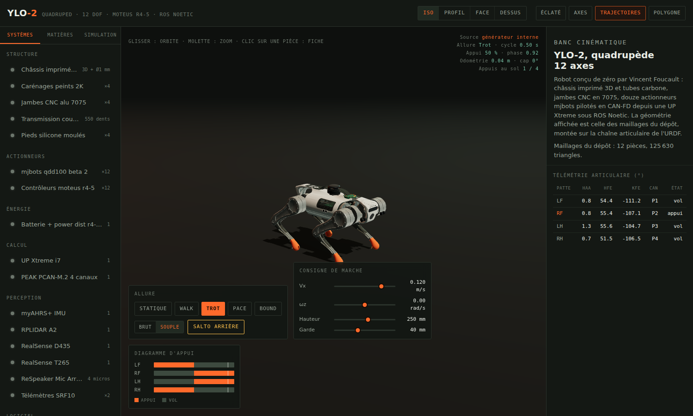
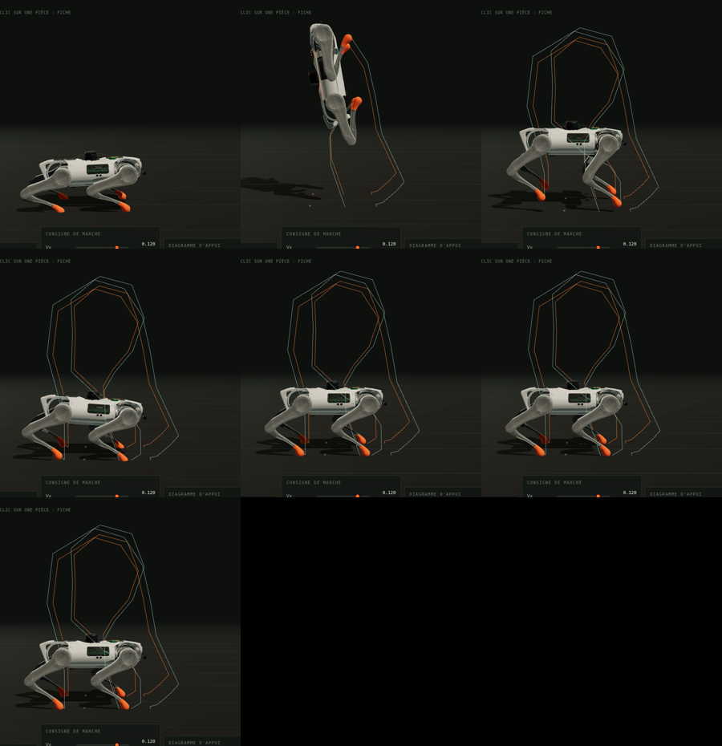

# YLO-2 — Banc cinématique 3D

Visualiseur 3D interactif et simulateur du quadrupède **YLO-2** de Vincent Foucault
([elpimous/ylo-2](https://github.com/elpimous/ylo-2)) : la machine est affichée avec
ses **vrais maillages**, montée sur la chaîne articulaire de son URDF, animée soit
par un générateur d'allure dans le navigateur, soit par des **scripts Python**.





## Trois pièces

| | Où | Quoi |
| --- | --- | --- |
| **Visualiseur** | `index.html` | page autonome : géométrie réelle, allures, télémétrie, éditeur de matières |
| **Convertisseur** | `tools/convert_meshes.py` | transforme les `.dae`/`.stl` du dépôt en paquet binaire compact |
| **Simulateur** | `sim/` | paquet Python `ylo2-sim` : cinématique, allures, bus CAN, trajectoires |

## Ouvrir

```sh
./build.sh        # assemble index.html (à refaire après toute modification de src/)
```

Puis ouvrir `index.html` dans un navigateur. Aucun serveur, aucune dépendance
réseau : three.js et les maillages sont embarqués dans le fichier (le seul appel
externe est Google Fonts, et la page reste lisible sans).

## Géométrie réelle

Les visuels affichés sont ceux du dépôt d'origine, pas des primitives :

| Pièce | Fichier source | Triangles |
| --- | --- | --- |
| Tronc | `ylo2_textured_body.dae` | 18 470 |
| Carénages | `ylo2_textured_cover.dae` | 30 064 |
| Moteurs ABAD | `ylo2_textured_abad_motors.dae` | 3 360 |
| Hanche | `ylo2texturedhip.dae` | 5 534 |
| Cuisse | `ylo2_textured_upper_leg.dae` | 30 000 (décimée depuis 49 176) |
| Jambe | `lower_leg.dae` | 7 284 |
| Pied | `fl_foot.dae` | 9 020 |
| Batterie, D435, T265, accessoires, lidar | `.dae` / `.stl` | 3 × … |

`tools/convert_meshes.py` les charge, nettoie (faces dupliquées ou dégénérées,
sens des normales), calcule les normales coin par coin avec un angle de cassure
de 35°, et écrit `assets/ylo2-geometry.bin` (4,0 Mo) + son index. `build.sh`
embarque le tout gzippé en base64 : la page fait 3,2 Mo et s'ouvre en `file://`.

Trois défauts d'affichage ont été corrigés à la source plutôt que masqués :

| Symptôme | Cause | Correctif |
| --- | --- | --- |
| Éclats triangulaires sur la cuisse | la décimation repliait la coque sur elle-même | plus de décimation par défaut (`--max-tris` pour forcer) |
| Coins mal éclairés sur les tambours | `smooth_shaded` regroupe par facettes coplanaires | normales par coin, moyenne pondérée sous l'angle de cassure |
| Scintillement hanche / carter d'abduction | surfaces coïncidentes entre deux pièces de l'URDF | `polygonOffset` sur le groupe hanche |

L'acné d'ombre sur les surfaces cylindriques est traitée par un `normalBias`
adapté, pas en désactivant les ombres.

```sh
python3 tools/convert_meshes.py --repo /chemin/vers/ylo-2   # régénère les maillages
```

Les placements (rotations et miroirs des visuels de hanche, `scale="1 -1 1"` des
cuisses droites, décalage du pied) reprennent exactement les `<xacro:if>` de
`leg.xacro`. Les pièces absentes du dépôt — UP Xtreme, PCAN-M.2, myAHRS+,
ReSpeaker, SRF10 — restent des volumes simples, signalés comme tels dans les fiches.

## Couleurs et motifs

Onglet **Matières** : dix groupes de pièces (carénages, châssis, moteurs ABAD,
hanches, cuisses, jambes, pieds, capteurs, batterie, électronique). Pour chacun,
couleur, métallicité, rugosité, motif et échelle du motif.

Les motifs sont dessinés sur canvas, donc modifiables dans
`src/20-materials.js` : alu brossé, carbone, impression 3D, anodisé, nid
d'abeille, tôle perforée, bandes d'atelier. Cinq ambiances servent de point de
départ (Atelier, Carbone, Chantier, Labo, Nuit).

Les maillages du dépôt n'ont pas de coordonnées de texture exploitables : les
motifs sont donc projetés en **triplanaire** dans le repère local de chaque
pièce (`onBeforeCompile`, trois échantillons pondérés par la normale). Pas de
couture, pas d'UV à produire, et le motif reste collé à la pièce quand elle
bouge. L'échelle du curseur est en motifs par mètre.

Les réglages sont conservés dans le navigateur (`localStorage`) et s'exportent en
JSON (`ylo2.materials/1`) pour être repris ailleurs.

## Locomotion

Deux styles, commutables dans le bandeau **Allure** :

**Brut** — le générateur nu, celui de `gait.yaml` : pied en sinusoïde, caisse en
sinusoïde, aucune compensation. C'est la référence, utile pour comparer.

**Souple** — la couche que les quadrupèdes modernes (Unitree Go2 et consorts)
empilent par-dessus, ici en cinématique pure :

- consignes lissées par limitation d'accélération (0,45 m/s², 2 rad/s²) ;
- choix d'allure selon la vitesse — marche sous 0,09 m/s, trot au-delà, arrêt à
  vitesse nulle — avec fondu des décalages de phase, sans à-coup ;
- vol du pied en **Hermite cubique** dont les tangentes prolongent la vitesse
  d'appui : le pied quitte et retrouve le sol à la vitesse du sol, donc plus de
  raclage ; tangente de sortie allongée, le pied recule juste avant de poser ;
- **placement à la Raibert** : demi-course d'appui plus un terme de rattrapage
  de l'erreur de vitesse — le robot « rattrape » ses pieds quand il accélère ;
- profil de garde asymétrique : montée vive, apex avancé, poser amorti ;
- enfoncement de caisse en milieu d'appui, report de masse latéral vers les
  appuis, inclinaison dans les virages, piqué proportionnel à l'accélération ;
- **compensation d'assiette** : les cibles de pied passent du repère horizon au
  repère tronc, donc les appuis restent plantés quand la caisse bouge ;
- respiration à l'arrêt.

Mesuré sur six secondes de trot à 0,15 m/s : le mode souple ne fait plus
pénétrer les pieds dans le sol (0,0 mm contre 8 mm) et glisse moins en appui
(0,08 m/s contre 0,11), pour un pic articulaire qui reste sous la butée de
vitesse de l'URDF.

### Salto arrière

Bouton **Salto arrière** du bandeau, touche `B`, ou
`ylo2-sim run sim/scripts/backflip.py`. Six phases : armement, bascule,
poussée, vol, réception, stabilisation. Le vol est **balistique** — la hauteur
et la rotation viennent de la gravité, pas d'une courbe décorative :

| Grandeur | Valeur |
| --- | --- |
| Vitesse verticale à la poussée | 2,95 m/s |
| Durée de vol | 0,60 s |
| Apex de la caisse | 0,76 m |
| Rotation | 360° en tangage |
| Recul | 0,10 m |
| Pic de vitesse articulaire | 7 rad/s (butée URDF : 20) |
| Butées franchies | aucune |

Le groupé part de la pose réellement mesurée au décollage et l'ouverture se fait
par interpolation à vitesse bornée : c'est ce qui garde la figure dans les
capacités déclarées des qdd100.

## Simulation Python

Le paquet `sim/` rejoue la chaîne embarquée hors ROS :

```sh
pip install -e sim/
ylo2-sim list
ylo2-sim run sim/scripts/trot_forward.py -o out/trot.json
```

Puis, dans la page : **Simulation → Charger une trajectoire**. Le générateur du
navigateur se met en retrait, les 12 angles viennent du fichier.

Pour piloter la boucle Python en direct depuis les curseurs de la page :

```sh
ylo2-sim serve --port 8770 --page index.html
```

La page sert alors de pupitre : `/api/stream` (SSE) diffuse l'état, `/api/cmd`
reçoit les consignes. Détails, API et scripts : [`sim/README.md`](sim/README.md).

## Commandes du visualiseur

| Action | Effet |
| --- | --- |
| Glisser | Orbite |
| Molette / pincement | Zoom |
| Clic sur une pièce | Fiche du sous-système |
| `1` `2` `3` `4` | Iso · profil · face · dessus |
| `Espace` | Bascule trot / statique |
| `B` | Salto arrière |
| `Échap` | Désélectionner |

Bandeau : vue éclatée (fige la machine et étiquette les sous-ensembles), axes
articulaires, trajectoires de pieds, polygone de sustentation.

## Structure

```
src/10-data.js        cotes, allures, sous-systèmes, groupes de matières
src/20-materials.js   matières PBR et motifs procéduraux
src/30-robot.js       décodage des maillages et montage de l'arbre cinématique
src/40-motion.js      cinématique inverse, allures, lecture de trajectoire, liaison directe
src/44-locomotion.js  style souple (Raibert, Hermite, assiette) et salto arrière
src/50-app.js         scène, rendu, interface
src/page.html         structure et styles
vendor/three.min.js   three.js r160 (UMD)
assets/               maillages convertis (binaire + index)
tools/                convertisseur de maillages
sim/                  simulateur Python (paquet ylo2-sim)
build.sh              assemble index.html et dist/artifact.html
```

## Sources des données

| Donnée | Fichier d'origine |
| --- | --- |
| Cotes, masses, butées | `champ_for_ylo2/ylo2_description/urdfs/const.xacro` |
| Chaîne articulaire, placements visuels | `champ_for_ylo2/ylo2_description/urdfs/leg.xacro` |
| Implantation des pattes | `champ_for_ylo2/ylo2_description/robots/ylo2.urdf.xacro` |
| Maillages | `champ_for_ylo2/ylo2_description/meshes/`, `Wolf_for_ylo2/wolf_descriptions/` |
| Paramètres d'allure | `champ_for_ylo2/ylo2_config/config/gait/gait.yaml` |
| Actionneurs et bus CAN | `Mjbots/README.md`, `Peak4can/README.md`, `moteus_driver/` |
| Capteurs | `Myahrs+/`, `Rplidar A2/`, `Respeaker4mic/`, `Realsense_cameras/`, `Devantech_SRF10/` |

La cinématique inverse du navigateur et celle du simulateur donnent les mêmes
angles au flottant près ; l'aller-retour cinématique est vérifié par les tests
(`erreur max ~1e-16 m`).
